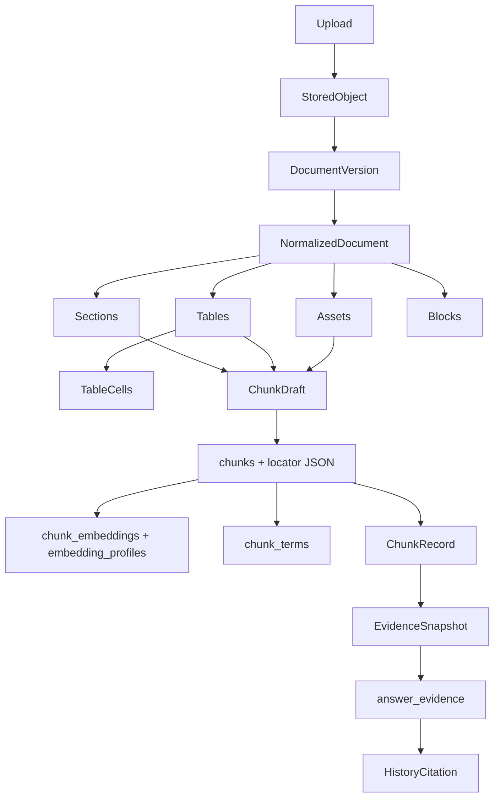

# P0 — Personal Multimodal RAG 当前架构与删除候选只读审计

审计日期：2026-10-07（Asia/Shanghai）。任务：最新 P0 附件 + 本轮动态路由规则。当前工作区为唯一项目事实来源；设计、旧报告和测试定义仅作为不同类型证据。审计结论不批准实际删除、替换、迁移、发布或里程碑验收。执行模式：**MANUALLY_SUPERVISED_TRIAL**。

## 一、授权、方法和证据等级

- 唯一允许写入：`docs/audits/p0-weknora-transition-current-state.md`；生成前确认不存在，不覆盖历史报告。
- 未修改源码、测试、migration、配置、数据库、账本；未调用业务模型、收费 API、DeepSeek 或 Langfuse；未启动服务、fetch/checkout/reset/stash、安装依赖或运行旧 P1。
- 本轮用户指令明确授权 FAST 索引、A/B/C 只读 Worker 和最终报告；其写入范围与最多三个同时运行 Worker 优先于 AGENTS.md 附录旧任务范围/数量。没有改 AGENTS.md 或全局配置。
- 主协调请求 GPT-6.1 Sol high；当前环境没有主线程换模接口，不能确认实际 serving identity/effort，记 **UNKNOWN**。FAST 请求 `gpt-6-luna/high`；NORMAL A/B/C 请求 `gpt-6.1-sol/medium`；派发参数不等于上游实际身份。未请求 Sol max，未升级 HARD：未出现需要 xhigh 才能裁决的关键证据冲突。
- FAST P0-INDEX/rev1 初始 attempt1 文件清单有效，符号命令因 PowerShell brace expansion 失败；attempt2 修正成功但输出截断，索引只标部分，不把截断当完整。A/B/C 复用具体文件清单与已返回符号，再在各自范围追踪。全部 Worker 无写入目标、未递归派发。
- `STATIC_CODE` = 当前源码可见调用/条件/SQL；`STATIC_TEST` = 已读断言，**NOT RUN**；`HISTORICAL` = 已有文档声称的旧结果，不能视作当前通过；`UPSTREAM_CODE` = 固定版本 WeKnora 源码；`UNKNOWN` = 缺乏本轮证据。IMPLEMENTED 不代表生产接通、开关开启、运行正确或已验证。
- **未实现的命令不得报告通过。** 本轮没有应用测试通过声明；只读命令成功只证明对应读取/静态检查完成。

## 二、共享基线

| 项目 | 本轮事实 |
|---|---|
| repository path | `C:\Users\22088\.codex\worktrees\rag-retrieval-opt-round1\RAG quention` |
| branch | `codex/local-first-rag-v1-20260930` |
| HEAD / 参考提交 | `dd4ca9eec47f2d19ca57fcdab2f6780c80f819fb` / 同一 SHA |
| 当前 HEAD 相对参考提交 | **SAME**：当前 HEAD 就是参考提交，不涉及谁先谁后 |
| 初始 `git status --short` | 空，工作区干净 |
| `git log -1 --format=fuller` | commit 同上；Author/Commit tiance002；2026-10-07 17:35:10 +0800；`feat: harden RAG quality and document evidence` |
| Python | 系统 `D:\Drivers\anaconda\python.exe` 3.12.7；本工作区 `.venv\Scripts\python.exe` 3.13.0；后者 AST 进程有 “Failed to find real location of D:\Drivers\python\python.exe” 提示，但静态进程退出 0 |
| backend 入口 | README.md:38 的 `python -m uvicorn backend.app.main:app`；main.py:`create_app` 与模块级 `app=create_app()`；bootstrap.py:`build_container` |
| 当前里程碑 | progress.md 记录 M4.5/V1.0；该文档包含大量历史阶段记录。本轮仅 P0 审计，不恢复发布/开发任务 |
| 仓库 migration | 13 个版本，线性 `0001_m0_core → 0002_m1_rag → 0003_m1_indexes → 0004_m2_assets → 0005_m3_graph → 0006_m4_agent → 0007_m4_budget → 0008_agent_step_cost → 0009_retrieval_perf → 0010_ingestion_leases → 0011_doc_filename_ux → 0012_chunk_strategy → 0013_message_run_link` |
| 真实 DB 已应用版本 | **UNKNOWN**：没有连接 DB 或读取凭据；历史 upgrade 记录不能代替当前实例证据 |
| 内容身份 | 初始 333 个 tracked 源码/测试/契约/相关文档逐文件 SHA-256；另补 6 个设计/状态/对照文档及 58 个 eval_center 消费端源码/测试，共 397 个；结束重新计算，详见附录 |
| 旧报告 | docs/SOURCE-STATE.md 是 2026-10-03/旧 SHA 快照；docs/design 与 reviews 中“无云适配器”等文字已落后于当前源码。不能套用旧 PASS |

基线检查中两次早期文件定位命令包含不存在的 `tests`、`docs/audits` 或 `backend/main.py`、`backend/app.py` 路径，相关 rg 退出 1/2；这些不是模块存在证据。随后由真实文件清单确认入口。未沿失败路径寻找凭据或运行数据。


## 三、当前真实端到端调用链

下表均为 STATIC_CODE；对应测试是 STATIC_TEST/NOT RUN。路径中 `app/` 简写为 `backend/app/`，`tests/` 简写为 `backend/tests/`，并非另一目录。

| 阶段 | 入口/核心符号 | 输入 → 输出与持久化 | 下游、失败处理、测试证据 |
|---|---|---|---|
| Upload | api/routes.py:109 `_submit_upload`，181 上传，288 新版本 | KB/document、UploadFile、duplicate_policy → receipt/job | 名称/范围/大小限制；store.create_upload/create_version；test_document_version_route、test_storage |
| Storage | adapters/storage.py:34 `put_stream` | 原始 bytes → SHA-256、size、objects/<prefix>/<hash> | 已存在对象复用；临时文件失败清理；原件保留；test_storage |
| Document/Version | postgres/knowledge_repository.py:81/105 | 文档身份 → version_no/source_sha256/storage_key/job | 行锁与唯一约束；skip 比对活动版本hash；失败候选不替换旧活动版本；test_version_activation、test_document_version_route |
| Worker/lease | workers/ingestion.py；repository:176/236/376 | queued job → 带claim_token的处理权 | 心跳/租约/所有权栅栏；失去所有权不提交；test_ingestion_state_machine、test_postgres_ingestion_leases |
| Parser | adapters/parsers/__init__.py:335 `ParserRegistry` | 原件路径+media_type+IDs → NormalizedDocument | 格式路由、partial/error；原文件保留；test_parsers、test_multimodal_ingestion、test_native_table_evidence、test_xlsx_table_evidence |
| Asset/Table/Locator | domain/models.py:9–135；各Parser | 章节/表格/单元格/图像/OCR/原坐标 → 中间模型 | PDF raw extraction与native_locator区别；资产blob/record先存；test_pdf_table_evidence、test_native_table_evidence |
| Chunk | domain/chunking.py:`profile_document/chunk_document` | normalized text/sections/tables → ChunkDraft序列 | adaptive策略，整行表格，原文span/quote；空内容/无chunk不伪装成功；test_chunking、test_original_header_boundary |
| Persist | repository:448/512/525/538 | assets/sections/chunks/terms → SQL与normalized Markdown blob | 普通表格结构没有单独table/cell SQL表，进入locator JSON；测试见各parser与DB摄取测试 |
| Embedding | repository:483；OllamaGateway.embed | chunk content →1024维向量/profile | count/dimension错误失败；chunk_embeddings与profile隔离；test_embedding_profile_isolation、test_postgres_scope_boundaries |
| Query/Scope | routes.py:`send_message`；answer_service.py:114 | conversation服务端KB/document范围、q0、mode → run | document归属/KB外发许可；幂等/取消/追问范围；test_scope、test_stable_run_requests、test_follow_up |
| Recall/Fusion | knowledge_gateway.py:283；retrieval.py:214；repository:601/646 | q0/规则terms+Scope+profile →候选hits | adaptive vector或hybrid；q0 keyword降级；weighted RRF；test_hybrid_retrieval、test_fusion、test_retrieval_routing |
| Coverage/Merge | knowledge_gateway.py:294–318 | 缺目标 →最多一次targeted补检/有界ID去重合并 | 扩展仅初始空召回且显式启用；保留q0；test_query_coverage、test_targeted_merge_bound |
| Rank | retriever可注入ranker/diversity ports | 候选 →重排/过滤原授权候选 | 生产未注入；启用缺失adapter拒绝；llm_rerank仅离线prepare/parse；test_llm_rerank |
| Context/Evidence | EvidenceService.bundle:123，ContextBuilder.select:13/build:70 | 完整chunks →8000字符context、E标签、snapshots | 字符含标签/分隔；整块跳过；coverage不足部分回答/拒答；test_context_pool_policy、test_evidence |
| Model selection/generation | quick_chain.py:66/104/190；langchain_agent.py:`run/create_agent` | context+q0 →candidate | Quick显式LOCAL/CLOUD；Smart ChatOllama；预算/授权/超时/length/取消；test_quick_chain_budget、test_langchain_agent |
| Validation/fallback | EvidenceService.finalize_answer:89；AnswerValidator；HardeningPolicy | candidate+plan+snapshot →answer/error/fallback | 规则能力有边界，fallback与原文模式不等于完整validator通过；第九节 |
| Citation commit | repository:1237 `finalize_answer` | 仅实际引用snapshots+answer →answer_evidence/events/message | run行锁，取消条件更新；失败不写成功assistant；test_cancellation_boundaries、test_message_run_link |
| History/readback/UI | repository:1060/1336；routes.py:455；frontend App.tsx:762/920 | run+label →冻结quote/locator/version/current_status | hash/旧chunk可读；历史NULL run不猜标签；引用抽屉；test_citation_resolution、test_message_run_link、frontend history-citation.spec.ts |

这些阶段不是严格的“先持久化全部再embedding”单线事务：资产可先提交，最终chunks/terms/vectors/ready/activation在后续事务中提交；失败重试可能遗留先前资产记录。Model selection在Quick prepare里早于真正生成，retrieval范围与云外发许可是不同边界。

## 四、数据模型、字段及 Domain ↔ SQL ↔ Migration



以下覆盖模型当前全部字段；同一组字段共享生命周期才合并，不表示每种格式都填写所有字段。模型定义准确位置为 domain/models.py:9/33/52/61/87/102/117/137/172。消费者依据第五/六/八节，未发现业务分支读取与无消费者严格分开。

| 模型 | 当前字段组 | Producer → Consumer / 持久化 / 状态 |
|---|---|---|
| NormalizedDocument | document_id, version_id, title, media_type | Parser入参/路径stem →chunk策略、身份；title通常来自内容寻址路径stem，未见独立SQL title写入，必要性UNKNOWN |
| 同上 | markdown_content, sections, tables, blocks, assets, source_locators | 各Parser →chunker/资产处理/caption准入；只Markdown blob、sections/assets/chunks被分别持久化，完整对象未存 |
| 同上 | content_sha256, parser_version, conversion_lineage, parse_status, parse_warnings | normalized文本hash/Parser与转换 →版本metadata、chunk locator与证据限制；hash在CAS重复计算是USEFUL一致性边界，不证明可删 |
| DocumentSection | section_id, heading, heading_path, level, start, end, page_start, page_end | Parser →profile、切片、section SQL；本地section_id重映射UUID |
| 同上 | content_type, asset_id | OCR/caption/table producer →chunk_type/asset关联；不是section SQL列，但持久化前有消费者 |
| DocumentAsset | asset_id, asset_type, storage_key, text_content, derived_from_asset_id, page_no, source_locator, source_bytes, status, error_code | PDF/image/OCR/caption →blob、document_assets、chunk_assets；source_bytes为排除JSON的临时二进制交接，不能按“未入DB”删掉 |
| DocumentTable | table_id, sheet, cell_range, header_rows, header_detection, conversion_lineage, source_format, page, bbox, raw_evidence, caption, merged_ranges, cells, start, end | native/PDF/XLSX →顺序block/整行render/chunk locator；无DocumentTable SQL表；raw_evidence另有保留缺口 |
| TableCell | coordinate, row, column, value, value_type, display, number_format, raw_number, formula, cached_value, cache_status, merged_anchor, column_headers, row_span, column_span, column_header, row_header, header_evidence, native_locator, bbox | 原格式解析 →row render、几何聚合、strict row proof、locator JSON；详第五节 |
| DocumentBlock | block_id, kind, table_id, start, end | native/PDF有序text/table块 →覆盖与混排chunk；无单独SQL表，不等于无价值 |
| SourceLocator | kind, page, start, end, bbox, table_bbox, raw_text, raw_evidence, quote, asset_id, sheet, table_id, cell_range, header_rows, merged_ranges, cells, conversion_lineage, source_format, header_detection, parse_status, parse_warnings | Parser与chunker →定位、内容证明、状态与来源门，chunks/answer_evidence JSON、API回读 |
| ChunkDraft | chunk_index, content, start, end, heading_path, chunk_type, content_sha256, source_locator | chunker →SQL、词项、Embedding；SQL使用enumerate index，和chunk_index重复可研究收敛，尚无替代 |
| ChunkRecord | chunk_id, knowledge_base_id, document_id, version_id, content, locator, heading_path, is_current, embedding, embedding_profile_id, content_sha256 | SQL或内存repo →Scope、retrieval、context、校验、引用；embedding为内存repo表示，生产SQL向量读取不装载此字段；不同read方法hydrate范围不同 |

没有证据证明上述任何一整个结构“纯未来预留、没有生产者”。默认空、None、某格式不填、只在内存表示，都不能推出无必要消费者。当前明确的未接通能力是父子RAG、生产邻块/LLM rerank、默认caption，而非据类型名称认定模型无用。

| Domain/行为 | SQL位置 | Migration |
|---|---|---|
| Document/Version/active/source key/hash | documents/document_versions/ingestion_jobs | 0001；0010 lease；0011 filename unique |
| DocumentSection/ChunkDraft | document_sections/chunks（locator JSONB） | 0002；0012 chunk strategy/version |
| Table/Cell/SourceLocator | 无专表，嵌套chunks.locator与answer_evidence.locator | 0002 JSON列；不是额外cell migration |
| Embedding profile / vectors / terms | embedding_profiles/chunk_embeddings/chunk_terms | 0002；0003/0009索引 |
| DocumentAsset / chunk association | document_assets/chunk_assets | 0004 |
| Evidence/Run/History | answer_evidence/rag_runs/retrieval_events/conversation_messages | 0002；0013 message→run（旧NULL保留） |
| Model budget/calls | model_calls及预算字段 | 0002；0007/0008 |
| Graph/Agent（仅说明持久化耦合，不扩展本轮比较） | graph/agent相关表 | 0005/0006 |

adapters/postgres/schema.py仅表名集合，不是ORM模型或建表程序；实际repository用SQLAlchemy text SQL。A有界范围未见运行时CREATE/ALTER DDL；未全仓证明不存在其他DDL，实际DB schema/应用版本均UNKNOWN。

## 五、表格使用矩阵

Producer缩写：X=XLSX parser；N=native HTML/DOCX；P=PDF；C=chunk_document。Consumer为实际代码消费者或明确序列化通道。后续必要性限定为用户要求的五种值，分类不是删除授权。

| 字段 | Producer | Consumer | DB持久化 | 测试覆盖（NOT RUN） | 后续必要性 |
|---|---|---|---|---|---|
| DocumentTable / cells | X/N/P | table_evidence.py:6/29/36 row render；chunking.py:174–252；structured_evidence.py:62–180 | locator内行+header cells | native_table、xlsx_table、structured_evidence | REQUIRED |
| coordinate/row/column | X/N/P | 同行同列唯一、range/坐标绑定、排序 | locator cells | 错行/错列/跨table拒绝 | REQUIRED |
| value/display/column_headers | X/N/P | 原行render与header/value、subject/month/amount匹配 | locator cells | wrong entity/month/unit | REQUIRED |
| value_type/raw_number | X，N/P有文本类型 | producer数值保真；消费端未见独立业务分支读取 | locator cells全量 | xlsx测试保留格式语义 | USEFUL |
| number_format | X | sheet row quote reconstruction structured_evidence.py:130 | locator cells | xlsx/structured row | REQUIRED |
| formula/cache_status | X | render；strict row proof:86–87明确拒绝公式/缓存语义不适用 | locator cells | xlsx formula/cache cases | REQUIRED |
| cached_value | X dual workbook读取 | formula/cache展示与来源信息；strict validator未直接以它算值 | locator cells | xlsx_table_evidence | USEFUL |
| merged_anchor/row_span/column_span | X/N/P | render/几何/工作量限制；strict规则拒绝不支持的merge | locator cells | merges、origin/spans、invalid row | REQUIRED |
| column_header/header_evidence/native_locator | N/P；X有其自身header策略 | DOCX声明header、sourcehash/doc/version、XML origin/continuation检查 structured_evidence.py:89–111 | locator cells | native_table、original_header_boundary、structured_evidence | REQUIRED |
| row_header | N/P策略 | 本轮消费端未见独立判定；原生语义与全量locator保存存在 | locator cells | native roundtrip | UNKNOWN |
| cell bbox / table page,bbox | P | row bbox聚合/原格式定位；table_evidence原row geometry | locator/cells | pdf_table_evidence | REQUIRED |
| header_rows/header_detection/source_format | X/N/P | 只允许明确header政策的row witness；unknown不提升为事实 | locator | 原PDF/DOCX表头不可确认时拒答 | REQUIRED |
| DocumentTable.raw_evidence / page raw_text/raw_evidence | P detach extraction | 中间结构与诊断；普通chunker未复制进table/text locator | 完整normalized未存，保留路径存在缺口 | PDF/完整normalized fixture | UNKNOWN |
| SourceLocator.raw_evidence | P/caption | quality.py:62–70 caption provenance；context_expansion.py:92–99实验门 | 若由chunk携带则JSON保存 | caption_fact_guard/provenance | REQUIRED |
| merged_ranges | X/N/P | 保留merge范围、序列化；strict规则主要读span/anchor | locator | native/xlsx roundtrip | USEFUL |
| conversion_lineage | DOC转换 | 文档→chunk lineage；与table上同名字段有重复来源 | locator | legacy_doc | USEFUL |
| parse_status/parse_warnings | Parser | complete/partial门与table_header_hint；限制说明 | locator | original_header_boundary/table_header_hint | REQUIRED |

**判断：SIMPLIFY_FIRST。** 可以研究 Table/TableRow + 独立证据证明对象 + 轻量Locator；当前未实现。若直接丢弃单元格坐标、声明header证据、公式/缓存/合并状态，将改变必要的“证据不足时拒绝”行为。字段搬家可以减少职责混杂；删除证明信息无法仅凭WeKnora更简洁来批准。

## 六、SourceLocator 职责

当前为 **OVERDESIGNED_CANDIDATE**：where（坐标）+what（quote/cells/raw_text）+validation proof（header与native lineage）+parser status同时存在。复杂的职责合并成立，不等于内容无价值。

| 字段/职责 | 建议 | 当前必要边界 |
|---|---|---|
| kind/page/start/end/bbox/sheet/table_id/cell_range/asset_id | KEEP | where；前端App.tsx:31–47显示kind/table/sheet/range/page/span；bbox/asset进入审计投影 |
| row、column | KEEP（以cell/range表示） | Locator无独立row/column字段；在cells与cell_range里，不能假称已存在独立列 |
| quote | MOVE_OUT_OF_LOCATOR（研究） | EvidenceSnapshot.quote/chunk.content重复，但structured_evidence.py:166要求locator.quote==content；先版本化适配 |
| source hash | KEEP（现有所属对象） | Locator无顶层source_sha256字段；原件在version、chunk/quote有各自hash，DOCX header证据嵌sourcehash |
| cells/header_rows/header_detection | MOVE_OUT_OF_LOCATOR | 迁到TableRowEvidence后仍须保证strict witness与旧JSON回读 |
| raw_evidence/raw_text | MOVE_OUT_OF_LOCATOR | 原始/派生/诊断区分；先补PDF持久化链，不把未落盘当可删 |
| conversion_lineage/source_format | MOVE_OUT_OF_LOCATOR（部分） | 迁往parser/source provenance，同时保留引用到不可变来源的连接 |
| parse_status/parse_warnings | MOVE_OUT_OF_LOCATOR | 独立parse-result/provenance对象；消费者仍须可判partial与缺表头 |
| REMOVE_CANDIDATE | 空集 | 未证明任何具体字段符合安全移除条件 |

API返回整个locator JSON，前端只展示少数字段不代表其它字段没有下游或历史用途。

## 七、SHA-256 与版本链

STATIC_CODE链：storage.py:34原件流hash → repository.create_upload/create_version保存source_sha256/storage_key → candidate version_no → parse/chunk/Embedding ready → repository:538–543锁文档并单调激活 → chunks.version_id → answer_evidence.version_id/chunk_id/quote_sha256 → get_citation:1336旧chunk回读。

- **KEEP_MINIMAL**：content-addressed原件、独立version身份、成功后激活、旧chunk保留。
- **REQUIRED_FOR_CITATION**：旧version/chunk及run-label-quote/hash/locator。快照仍依赖旧chunk FK与containment，不能仅留quote然后删旧chunk。
- immutable指来源字节/内容寻址和版本身份；不表示所有metadata不可修改、数据库不可被外部写入或Pydantic嵌套对象不可变。
- 当前历史source API只选择active（无active则latest candidate），并无按引用旧version直接下载原件的独立公开入口；历史quote/chunk SQL可回读，旧原件key仍在versions中。这两种“历史回读”不能合并。
- **已复核风险 V1**：create_version:150提前更新documents.file_name/media_type；process_job:404/421以当前d.media_type解释候选原件；get_document_source:993/1014把active blob配当前文档metadata。旧job排队或新候选失败/更换格式时可能错配。STATIC_CODE可达风险，未执行复现，建议P1；后续缩版前须以版本自身metadata冻结解释方式。
- 未找到足以直接删除的版本逻辑；OVERDESIGNED/REMOVE_CANDIDATE集合均为空，不为凑候选删版本。

## 八、EvidenceSnapshot / EvidencePlan / structured evidence

`EvidencePlan/EvidenceTarget` 在 query_router.py，表达问题的subject/attribute/period/unit与relation；不是DB evidence snapshot。structured_evidence.py的RowFact是从原始行严格验证的事实值，也不是额外永久表。EvidenceBundle是一次共享检索/coverage/context边界。

创建：Quick的ContextBuilder.build → CitationService.freeze；Smart的EvidenceAccumulator.freeze → domain.freeze_evidence。字段：label、version_id、chunk_id、quote、quote_sha256、locator。成功后只提交实际引用snapshots，repository.finalize_answer:1249/1274–1288在事务里写snapshot、事件与assistant消息。

| 集合 | 内容/理由 |
|---|---|
| 必须保留 | run-label稳定身份、immutable version/chunk、实际quote/hash、来源locator快照、旧源可读校验、取消时不提交；history NULL run不猜E1 |
| 可以缩小 | quote在locator与snapshot重复、table proof与where职责分离、临时EvidenceBundle/快照表示收敛；须先实现新版兼容合同、验证旧JSON/严格row checks |
| 可以删除 | **空集**；Chunk+Version+轻量Locator+Citation snapshot只是替代设计，尚未落地，不能计为已替代 |

快照确实防止“自动随当前版本切换引用内容”：SQL join冻结version/chunk，hash摘录并验证摘录仍在旧chunk内。它不独立保证旧chunk可永久读取；没有整份原文件重读、locator坐标重建或locator hash校验。domain/evidence.py:27为浅dict复制，Pydantic frozen不递归冻结嵌套dict/list。故“完全不可变”“原件坐标已验证”均不成立。

引用消费者：API routes.py:455–460 → client.ts getCitation → state.ts run_id/citation_id → ChatPanel label → App.tsx:920–932 quote/status/locator抽屉。test_evidence、test_citation_resolution、test_evidence_accumulator、test_message_run_link、history-citation.spec.ts保护产品行为；其中旧NULL run不乱猜引用是必要迁移语义，不归LEGACY_TEST_DEPENDENCY。


### 数据处理接线补充（STATIC_CODE，运行可用性未验证）

| 格式 | 当前实现/生产前提 | 失败或限制 |
|---|---|---|
| TXT/Markdown | TextParser；newline normalization/Markdown heading | binary/NUL/UTF-8错误；空内容拒绝 |
| CSV | TextParser("text/plain") | 不是结构化CSV表格解析 |
| HTML/XHTML、DOCX | HtmlParser/DocxParser →native.py/native_worker.py | 需显式RAG_NATIVE_TABLE_PYTHON；输入/archive/XML/active-content/外部关系/嵌套/跨度/输出schema/timeout限制；unknown header保留原文并拒绝当数值证明 |
| DOC | DocParser →可选converter→DOCX | bootstrap默认不注入converter，默认DOC_CONVERSION_UNSUPPORTED；存在实现不能报默认可用 |
| XLSX | XlsxParser，formula与data_only双读取 | 不执行公式；cache missing明确；archive/XML/style/cell/grid/resource limits |
| XLS | 未见注册生产解析链 | NOT_IMPLEMENTED，不能把XLSX支持写成XLS支持 |
| PDF | PyMuPDF text/table与本地OCR | password/signature/open错误；扫描页OCR缺失/空，结构识别失败partial；保留原件 |
| image/* | PIL校验+fitz本地OCR | OCR_UNAVAILABLE/empty不可伪装ready；caption实现未生产接通 |

normalized.title常由传入path.stem取得，实际CAS文件名为hash；上传媒体类型优先采用提供值，泛型类型再猜测，而CAS路径无原后缀。真实upload到parser行为不能只靠带正常后缀fixture推定。资产在最终chunk事务之前持久化，失败/重试资产幂等性需后续核对；本轮不做清理。

## 九、AnswerValidator：规则、强度、后续分类

调用链：Generation → EvidenceService.finalize_answer → AnswerValidator.validate → HardeningPolicy.finalize → 成功/原文fallback/明确错误 → 原子提交或拒绝。Smart共用该校验入口；不是另一个完整RAG实现。

| 实际规则 | 证据与分类 | 后续分类 |
|---|---|---|
| 引用label不存在 | answer_validation.py:84–89，集合差；HardeningPolicy亦检查marker形状与允许标签 | 强身份规则；KEEP_LIGHTWEIGHT |
| 无citation且无固定拒答词 | :84–87；空输出亦进入不支持；固定“资料不足/无法回答/没有足够证据”只是词法豁免 | 身份/空输出保留；拒答豁免NEEDS_REDESIGN，不能证明每个事实有证据 |
| “X方案attribute数字” | :104–114，限定regex，要求该clause引用的原文同类fact含该数字，排除caption | 启发式绑定；REMOVE_OR_SIMPLIFY须先保留必要错主体/错金额保护 |
| caption引用下的数字 | :101–103、160–196；分离claim，不能借其它fact数字；native prose采用整statement字面相等，table走row proof | 有界精确原文保护KEEP_LIGHTWEIGHT；分句/标识符识别仍启发式 |
| 月份/单位/结构化表格 | :119–131 + structured_evidence.py:62–180；源hash、quote、坐标、header、DOCXsourceversion、原行render、Decimal/value/unit与冲突检查 | 条件成立后的强结构比对KEEP_LIGHTWEIGHT；支持面窄，不能概括所有表格 |
| prose targets | :133–156 + QualityGate.supporting_fact：subject/attribute近距离词法+数字集合包含 | Heuristic；NEEDS_REDESIGN，数字出现不等于同一事实蕴含 |
| relation coverage | quality.py:36–43，同clause两主体+固定关系词 | Heuristic / 上游coverage补救；REMOVE_OR_SIMPLIFY前先保留缺证据拒答 |
| 无targets | answer_validation.py:115–116在marker/窄金额检查后返回None | 不是通用entailment Validator；存在实际保护缺口，不是已实现全量事实检验 |
| self-contradiction | answer_hardening.py:173–181 固定否定词与后续positive/topic | Heuristic；NEEDS_REDESIGN |
| 多问题coverage | answer_hardening.py:80–90/244 exact topic presence，仅观测 | 不是强制“每问已完整答对”，不得据它宣称质量保证 |
| citation relevance | answer_hardening.py:114–116，字面quote命中为SOURCE_TEXT_MATCH，其它UNKNOWN | 诊断，不是语义验收 |
| finish_reason=length | Ollama/DeepSeek adapter以及生成分支识别 | 强传输终止信号KEEP_LIGHTWEIGHT，位置不在AnswerValidator内 |
| required fields/坏provider输出 | provider/parser schema与空content检测 | 保留所在边界；没有一个已实现的通用“所有答案必须字段校验”规则可供删改 |

上游补救：缺target一次补检、coverage/partial/refusal、模型prompt要求逐事实引用、hardening本地审计后extractive fallback。这些有不同责任，不能合并成“一套强确定性校验”。

**已复核风险 V2：最终成功路径不普遍重跑完整Validator。** HardeningPolicy.finalize:208–249可在candidate失败且审计SAVED_LOCAL后调用evidence_fallback:127–170，237行因存在fallback清error，没有再validate。target fallback用supporting_fact，不是strict row_facts，也没有该分支独立caption过滤。Quick evidence-only:354–357只observe，partial回答也是生成前路径。该事实不自动证明已发生错误，但禁止声称所有最终成功答案都满足同一完整数值校验。建议后续简化前定义统一最终提交不变量与针对性回归，保留fail-closed和不发布被拒candidate；本轮不修复。

静态断言：test_answer_validation.py:26–29与40–46检查合法数值、变值、错主体、错引用、无引用；test_structured_evidence检查错月/单位/冲突/foreign header；test_answer_hardening检查审计失败不得fallback、相关性UNKNOWN。这些是必要产品保护，不因旧实现将来替换而永久保留现有函数，但须迁移行为测试。本轮全部NOT RUN。

## 十、Cloud Usage Accounting

**KEEP已有统计与预算门；不能宣称all-call覆盖或真实节省。**

| 维度 | 当前记录位置/能力 | 缺口或语义 |
|---|---|---|
| prompt/completion/total tokens | ports/model_usage.py ModelCall.input/output；Ollama响应映射；Smart message metadata；DeepSeek usage归一化 | 顶层RunMetrics.total仅query+answer；不是全部模型Token |
| provider/model | RunMetrics record_generation/note_provider；adapter配置名；DeepSeek receipt.response_actual_model | ModelCall本身无provider字段；请求/配置模型名不是上游独立身份；Ollama统一统计不核验实际响应model |
| purpose/stage | query/answer/embedding；role business/judge | stage allowlist没有独立rerank/VLM/OCR；query包含expansion与追问，非完全分purpose |
| latency/status/finish | 每call及RunMetrics；错误保留UNKNOWN tokens | caption单独usage_actual/latency；未capture的调用不会自动记录 |
| retry | RunMetrics.retry_count=0，basis为未配置应用/provider重试 | 不代表供应商内部重试/计费情况已知；fallback另一次调用不等于同provider自动重试 |
| paid/free | 预算、provider和cloud/local path | 无成熟统一paid/free或cheap/expensive分类；本地算力未计价，不能叫“免费” |
| actual monetary settlement | Quick budget.settle(cloud_cost_estimate_microunits) | configured estimate，不是供应商账单 |
| reserved/unknown | PostgresBudgetGate与session/reviewed gates | 防超支占用与真实已扣款不同；unknown保留占用，明确未发送可释放 |
| DB model_calls Token列 | migration0002有input/output列 | budget.py:168–218 writer写预留/结算状态，未填Token列；有列不代表已有数据 |

| 调用类别 | 当前统计状态 | 能否并入完整Total API Usage |
|---|---|---|
| Quick answer | AnswerService.collect_metrics范围内，adapter真实返回token映射；未instrumented provider补UNKNOWN | 当前请求可观测，不代表账单 |
| Smart messages | langchain_agent.py:113–131逐message usage；before/after limits | message缺usage则UNKNOWN；最终文本估算限额不是全message真实累计限额 |
| Query expansion/history resolution | query stage；失败q0/澄清；scope内捕获 | 只能query汇总，未分两种purpose |
| Query embedding | capture内model_calls数组保存embedding记录 | 顶层total排除它；embedding无completion时summary availability可unavailable |
| Ingestion embedding | repository:483–484存在真实provider调用 | 不在AnswerService capture；未证明摄取自身capture，统一覆盖缺口 |
| LLM rerank | 仅离线prepare/parse，生产未接线 | 未实现统一模型调用/统计 |
| VLM/caption | Ollama.caption_image独立usage_actual；LocalCaptionEnricher未接生产 | 绕开_post/record_call，不入统一ModelCall；digest未知 |
| OCR | 本地fitz OCR链，不是云模型调用 | OCR运行耗时/资源未统一模型账本计量；不伪称provider token为0或已覆盖 |
| 评测/其它脚本 | eval_center/runner.py、public_runner.py显式capture_usage | 仅相应runner作用域；不证明手工操作、全部脚本/业务调用都受统一capture |

DeepSeek三条渠道必须分开：ModelCall归一化；receipt.provider_usage/response_actual_model；gate.finish_with_usage的占用结算。length/error的归一化Token为UNKNOWN，receipt仍可能有provider_usage。普通DeepSeek.answer拒绝外发，受专用scope/gate/receipt的入口才可能发送。本轮**没有调用、没有读取账本**，保留既有7 calls/855 tokens历史约束，不复位、不据旧累计推算当前余额。

后续指标可行性：Total API Usage=PARTIAL；Paid/Cheap/Expensive Usage=缺统一价格/分组/全调用scope；Dynamic Router Saving=NOT_IMPLEMENTED/NOT_EVALUATED，需要真实对照、价格/缓存/重试/unknown占用语义与已批准实验，不能从现有估算settle推算。

## 十一、Local/Ollama 职责与耦合

| 职责 | 入口/调用方 | 状态与删除边界 |
|---|---|---|
| Chat Quick | bootstrap.py:137–142 →OllamaGateway.answer_with_budget/answer | local_answer_enabled默认true；替代前KEEP_UNTIL_REPLACEMENT |
| Chat Smart | bootstrap.py:109–119独立ChatOllama →LangChain create_agent | 同模型配置但不同对象；关闭local_answer令smart_agent=None |
| Embedding | 同OllamaGateway.embed注入repository及HybridRetriever | 独立bge-m3模型/profile；LOCAL_EMBEDDING_SEPARATE_DECISION |
| Query Expansion | ModelPolicy→query_expand；KnowledgeGateway空召回按需调用 | 默认off，异常q0 fallback；删Chat对象不能顺带破坏它 |
| Follow-up | API注入ollama→resolve_history_json | 默认off，local-only无代理/重定向、时间/输出限制；需单独替代 |
| Caption | caption_preflight/caption_image；LocalCaptionEnricher | 未生产接通；生成内容标UNVERIFIED/不得当原始数值证明 |
| Generic ports | Answer/Embedding/LocalQuery/FollowUp/Caption protocols | GENERIC_PROVIDER_ABSTRACTION_KEEP；role拆分比删整个gateway安全 |

配置默认qwen3.5:4b与bge-m3:latest来自config.py，不代表本机安装/当前可用。本轮未执行ollama list/show或模型冒烟，NOT RUN。LOCAL_CHAT_REMOVE_CANDIDATE是未来替代目标，不是SAFE_DELETE_CANDIDATE；LOCAL_NAMING_REMOVE_CANDIDATE须先区分“本地隐私/外发限制”与“模型价格档位”，不能盲改local-only授权语义。

## 十二、Router 清点与改造边界

| 对象 | 当前职责与证据 | 后续建议 |
|---|---|---|
| QueryRouter.plan | query_router.py:62–109，规则EvidencePlan/Target single/parallel/comparison/relation | KEEP；可RENAME为EvidencePlanner，不能被价格Router代替 |
| RetrievalRouter.route | retrieval_policy.py:14–41，adaptive/vector/keyword/hybrid，无LLM | KEEP；是否重构随检索替代，不能由Cheap/Expensive直接替代 |
| ModelPolicy.build_query_plan | model_policy.py:8–33，按需query expansion/失败q0 | RENAME或KEEP接口语义，不是模型选型Router |
| ExecutionRouter.choose | execution_routing.py:13–25，显式LOCAL/CLOUD+全局/KB/provider许可 | REPLACE_WITH_DYNAMIC_MODEL_ROUTER仅限模型选择部分；授权/预算门必须KEEP并在选择后实际执行 |
| Quick/Smart mode | API mode枚举；AnswerService分派Quick Runnable / create_agent | KEEP，执行方式不等于模型价格 |
| GenerationBudget | intents/context →512/896/1280输出cap | KEEP或单独简化；不是模型切换 |
| Cloud authorization / budget | Scope+allKB cloud_allowed+global switch+预算+DeepSeek封闭gate/receipt | KEEP；不能以动态选型绕过 |
| 资源路由 | 文档8GB建议与caption BGE繁忙检查；无一般性GPU自动调度器 | PARTIAL，未验证本机有效配置 |
| Cheap/Expensive Dynamic Router | 无按难度/价格/余额动态切换聊天模型的生产实现 | NOT_IMPLEMENTED；两个DeepSeek允许model字符串不等于dynamic选择 |

Quick local生成失败可以在显式cloud_fallback_enabled下经同一授权/预留进行一次云fallback，CLOUD失败不递归；默认关闭。Smart仍本地ChatOllama路径，未证明有对应cloud dynamic routing。未找到可直接REMOVE整个Router而保持行为等价的证据。

## 十三、当前 RAG 主链状态

生产默认：`服务端Scope → q0规则planning → adaptive语义Vector / 标识符Hybrid(Vector+TF Keyword→weighted RRF) → 无生产ranker → 完整chunk Context → evidence coverage → Quick/Smart generation → 有界验证/降级 → Citation/History`。

| 能力 | 实现状态 | 生产接线/默认/验证边界 |
|---|---|---|
| Dense | IMPLEMENTED | pgvector cosine <=>、profile与active/ready/KB/document过滤、HNSW；NOT RUN |
| Keyword | IMPLEMENTED | SUM(term_frequency)+whole-query bonus2；不是BM25 |
| Fusion/RRF | IMPLEMENTED | weight/(60+rank)，vector .7 keyword .3；不叫语义置信度 |
| candidate/top-k | IMPLEMENTED | profile candidate32/top5；context8000字符 |
| context pool | IMPLEMENTED opt-in | 默认off；开启pool10/final8；多pass原策略回退，test_context_pool_policy |
| Rerank port | PARTIAL | 原授权候选身份防注入；bootstrap:76–79启用无adapter直接拒绝 |
| LLM rerank | EXPERIMENT_ONLY | prepare/parse/prefix完整ID permutation，不调用provider |
| MMR | PARTIAL hook / adapter NOT_IMPLEMENTED | 生产无adapter，启用拒绝 |
| neighbor | EXPERIMENT_ONLY | policy、repository read_context_rows及离线脚本存在；Quick/Smart无接线 |
| parent-child | NOT_IMPLEMENTED（生产链） | 没有parent索引/子召回/父回填闭环；每document soft cap不是parent-child |
| Context Builder | IMPLEMENTED | 含E标签/分隔符字符预算、whole chunks、软document quota |
| evidence merge | IMPLEMENTED | 缺target最多一次补检，ID去重，上限2*top_k；不是正文重叠合并 |
| expansion | PARTIAL optional | 初始空召回才L1、默认off、q0保留；一般rewrite NOT_IMPLEMENTED |
| evidence quality | IMPLEMENTED diagnostic | RETRIEVAL_HEURISTIC_NOT_ANSWER_CORRECTNESS，不能据此自动上云或语义验收 |
| citation/history | IMPLEMENTED | 冻结version/chunk/quote/hash/locator回读；限度见七/八节 |

后续可能替换的自研部分为parser编排、策略chunker、候选融合/可选rank/merge/context装配；目前都有实际消费者，列KEEP_UNTIL_REPLACEMENT。冻结profile与q0 fallback、服务端Scope、embedding profile、citation invariant应迁到新链，不能连同旧实现一起删掉。历史检索/质量报告不等于当前版本运行验证。


## 十四、WeKnora 有界对照（在本项目链核实之后）

上游固定 **Tencent/WeKnora v0.8.2 → commit 3e8b0bfc80b845b2d4b2ed683994748741450a97**；官方Git ref API解析，tree.truncated=false。只读取本节能力对应源码，未克隆/构建/运行。**本机部署版本UNKNOWN**，未给出或扫描部署目录、服务、DB。初次web页面提取工具返回“Failed to fetch restricted URL”；官方公开Git API元数据及固定commit源码的独立只读请求成功，无本机权限拒绝或审批绕过。上游检查也是静态接线证据，不是本机实测。

来源索引（均为上述固定commit，引用直接指源码）：

- W1：[PDF parser](https://github.com/Tencent/WeKnora/blob/3e8b0bfc80b845b2d4b2ed683994748741450a97/docreader/parser/pdf_parser.py#L167)（classify167、调用1507、scanned metadata1407/1605）；[registry](https://github.com/Tencent/WeKnora/blob/3e8b0bfc80b845b2d4b2ed683994748741450a97/docreader/parser/registry.py#L151)与[Go engine](https://github.com/Tencent/WeKnora/blob/3e8b0bfc80b845b2d4b2ed683994748741450a97/internal/infrastructure/docparser/engines.go#L70)确认可选engine/DocReader依赖。
- W2：[DOC parser](https://github.com/Tencent/WeKnora/blob/3e8b0bfc80b845b2d4b2ed683994748741450a97/docreader/parser/doc_parser.py#L178)、[DOCX chain](https://github.com/Tencent/WeKnora/blob/3e8b0bfc80b845b2d4b2ed683994748741450a97/docreader/parser/docx2_parser.py#L10)、[Excel](https://github.com/Tencent/WeKnora/blob/3e8b0bfc80b845b2d4b2ed683994748741450a97/docreader/parser/excel_parser.py#L78)。
- W3：[Image parser](https://github.com/Tencent/WeKnora/blob/3e8b0bfc80b845b2d4b2ed683994748741450a97/docreader/parser/image_parser.py)、[ImageMultimodal.Handle](https://github.com/Tencent/WeKnora/blob/3e8b0bfc80b845b2d4b2ed683994748741450a97/internal/application/service/image_multimodal.go#L151)；container.go:265接service，274起OCR/VLM分支、315起派生chunks。
- W4：[chunk types/locations](https://github.com/Tencent/WeKnora/blob/3e8b0bfc80b845b2d4b2ed683994748741450a97/internal/types/chunk.go#L124)；[adaptive strategy](https://github.com/Tencent/WeKnora/blob/3e8b0bfc80b845b2d4b2ed683994748741450a97/internal/infrastructure/chunker/strategy.go#L34)；[splitter/ContextHeader](https://github.com/Tencent/WeKnora/blob/3e8b0bfc80b845b2d4b2ed683994748741450a97/internal/infrastructure/chunker/splitter.go#L21)。
- W5：[ingestion/parent-child wiring](https://github.com/Tencent/WeKnora/blob/3e8b0bfc80b845b2d4b2ed683994748741450a97/internal/application/service/knowledge_process.go#L3813)（3826开关/3828 SplitParentChild；511/572存父子关系；664用EmbeddingContent）；[parent resolve/merge](https://github.com/Tencent/WeKnora/blob/3e8b0bfc80b845b2d4b2ed683994748741450a97/internal/application/service/chat_pipeline/merge.go#L44)。
- W6：[hybrid search](https://github.com/Tencent/WeKnora/blob/3e8b0bfc80b845b2d4b2ed683994748741450a97/internal/application/service/knowledgebase_search.go#L278)、[weighted RRF](https://github.com/Tencent/WeKnora/blob/3e8b0bfc80b845b2d4b2ed683994748741450a97/internal/application/service/knowledgebase_search_fusion.go#L129)、[defaults](https://github.com/Tencent/WeKnora/blob/3e8b0bfc80b845b2d4b2ed683994748741450a97/internal/types/retrieval_config.go#L87)。
- W7：[rerank](https://github.com/Tencent/WeKnora/blob/3e8b0bfc80b845b2d4b2ed683994748741450a97/internal/application/service/chat_pipeline/rerank.go#L38)、[neighbors](https://github.com/Tencent/WeKnora/blob/3e8b0bfc80b845b2d4b2ed683994748741450a97/internal/application/service/chat_pipeline/merge_expand.go#L11)、[Top-K](https://github.com/Tencent/WeKnora/blob/3e8b0bfc80b845b2d4b2ed683994748741450a97/internal/application/service/chat_pipeline/filter_top_k.go#L27)。
- W8：[model-context references](https://github.com/Tencent/WeKnora/blob/3e8b0bfc80b845b2d4b2ed683994748741450a97/internal/application/service/chat_pipeline/references.go#L16)、[citation handles](https://github.com/Tencent/WeKnora/blob/3e8b0bfc80b845b2d4b2ed683994748741450a97/internal/modelcontext/citations.go#L94)、[completion caller](https://github.com/Tencent/WeKnora/blob/3e8b0bfc80b845b2d4b2ed683994748741450a97/internal/application/service/chat_pipeline/chat_completion.go#L53)。
- W9：[production registration](https://github.com/Tencent/WeKnora/blob/3e8b0bfc80b845b2d4b2ed683994748741450a97/internal/container/container.go#L488)：Search/Rerank/Merge/IntoChatMessage/FilterTopK被注册；不是凭README推定已接线。

| 能力 | 当前项目 | WeKnora思路/源码接线 | 后续建议（仅设计建议） | 接入前提/依赖、会丢失什么、复杂度判断 |
|---|---|---|---|---|
| PDF text/scanned page routing | PyMuPDF text/table、本地OCR；partial/证据状态 | W1逐页image-area+text-length分类，扫描页render+image_source_type，Go W3再OCR/VLM | ADOPT_WEKNORA_STYLE | 先定义页级路由与原件映射；依赖PDF引擎、图像存储及可用OCR/VLM。不能丢现有表格native geometry/raw evidence；分层可能降低职责混杂，接全sidecar/队列并不必然更少代码 |
| DOC/DOCX | DOC默认无converter；DOCX受限native worker+声明header证据 | W2 DOC转换→DOCX/antiword/textract；DOCX Markitdown与DocxParser链 | ADOPT_WEKNORA_STYLE | 需要converter/runtime/timeout隔离；若只取Markdown将丢DOCX声明表头、原cell XML/sourcehash证明。编排可简化，依赖数量可能增加 |
| XLS/XLSX | XLS未实现，XLSX保存formula/cache/merge/坐标 | W2 pandas按行key-value chunks；默认首行仍数据、列字母，显式选项才第一行为header | SIMPLIFY_TO_WEKNORA_STYLE | 先决定产品精确数值能力；需Excel engine/转换依赖。不保存sheet/cell细节会损失当前溯源与保守拒答信息；行模型更轻，但必须保留独立proof才能等价 |
| Image OCR + Caption | OCR生产；caption未接通 | W3解析层返回图像引用，Go任务分OCR/Caption并产生各类型child chunks | ADOPT_WEKNORA_STYLE | 需明确local/cloud权限、资产lineage、caption非原文证据与全调用计量。引入异步子任务有额外状态，不能自动叫简化 |
| Source Locator | 当前where+what+proof+parse state | W4主要Chunk start/end、关联ID、metadata/ImageInfo；不是已证等价的SourceLocator类 | KEEP_OUR_EXTENSION | 按第六节搬出proof/status，保留version/页/原cell证据连接；上游定位结构不能证明满足本项目历史引用与strict row合同 |
| Adaptive Chunking | 本项目adaptive/profile/表格整行 | W4 auto/heading/heuristic/recursive/legacy策略；W5生产config传递 | ADOPT_WEKNORA_STYLE | 需Python实现/端口适配，保护原始offset与表格完整性；不复制Go运行栈。可收敛策略入口，但内容重切将改变chunk ID/引用，不可直接覆盖旧索引 |
| Parent-Child | 生产未实现 | W4父子split；W5存parent、child索引、merge回填父文本 | ADOPT_WEKNORA_STYLE | 需parent schema/index policy/scope-aware回填/context预算和引用粒度。新增能力会增加复杂度；不能把同document quota当已具替代 |
| Context Header | heading_path保存，未证明生产EmbeddingContent加header | W4独立ContextHeader，W5:664 embedding input加breadcrumb | ADOPT_WEKNORA_STYLE | 先确定检索文本与原文quote分离，标题不得伪装原文；需新profile/reindex版本。能减少缺上下文，不代表无需版本迁移 |
| Hybrid Retrieval | adaptive conditional hybrid+TF keyword+weighted RRF | W6按channel融合，.7/.3/k60，W9注册search | KEEP_CURRENT | 本项目已借鉴该rank融合，没必要为名称再换一遍；keyword backend与阈值需独立评测。保留Scope/profile/fallback，不把RRF当置信度 |
| Rerank | hook/纯离线合同，生产无adapter | W7配置model才调用；API失败fallback；另有MMR；W9实际注册 | ADOPT_WEKNORA_STYLE | 需具体可用ranker、预算/外发/耗时、候选身份保护。增加模型成本/依赖；不是无条件简化，也不复制所有阈值和MMR |
| Merge | ID去重+最多一次targeted合并 | W5/W7父回填、同source/type正文range合并、邻块和重叠去重 | ADOPT_WEKNORA_STYLE | 需原始chunk↔合并文本引用映射，禁止跨KB/version合并。可能减少重复上下文，算法/证据映射复杂度上升；上游历史引用注入不直接搬入本项目 |
| Top-K / Context assembly | candidate32/top5/8000字符；optional pool10/final8 | W7分阶段Top-K，MergeResult优先；W8当前sources建模型context | KEEP_CURRENT | 保留明确候选/最终context预算；先验证不同字符/Token与whole-quote要求，不能只复制默认数值。阶段分离已存在，无需为成熟度重写 |
| Citation | E标签+run/version/chunk/quote/hash/locator快照，旧版本回读 | W8当前源handles↔公开引用转换，history handles只导航，completion实际调用 | KEEP_OUR_EXTENSION | 可借handle规范化；没证据证明等价不可变version+quote/hash回读。替换会危及本项目历史稳定性，先保留旧合同 |

本表没有比较Wiki/Graph/MCP/多租户/ASR，也未把上游依赖、外发默认值或整个架构当作项目未来前置。没有执行外部模型、WeKnora服务或源码测试。Recommendation中的ADOPT/SIMPLIFY都不是“已实现替代”，不能据它批准删现有必要行为。

## 十五、候选四类清单

| 类别 | 候选/结论 | 依据 |
|---|---|---|
| SAFE_DELETE_CANDIDATE | **空集** | 无候选同时证明无必要消费者、后续不需要、删除不破坏必要行为。旧实验无生产接线仍有测试/脚本/metadata关联，不凑数量 |
| SIMPLIFY_FIRST | SourceLocator、TableCell/DocumentTable、EvidenceSnapshot表示、AnswerValidator/Hardening职责、重导出usage兼容层 | 先独立where/proof/parser state；保留strict numeric与history；compat exports有真实imports |
| KEEP_UNTIL_REPLACEMENT | Local Chat/ChatOllama；价格选择部分ExecutionRouter；自研Parser/Chunker/HybridRetriever/Context；实验邻块/rerank簇；PDF raw evidence通道 | 尚无已实现、已验证的替代；有当下必要消费者或保留缺口/未知用途 |
| KEEP | SHA-256 minimal versioning、Citation provenance/历史readback、Embedding profile isolation、Cloud usage/budget、Provider ports、服务端Scope/外发/取消边界、q0/失败回退 | 本轮源码支持其持续必要性 |

“当前必要行为”“旧内部API/旧输出协议”“替代未落地”“无法确认用途”分开：整行数值证明/旧引用回读为当前必要；usage import路径为内部兼容，最终可迁但仍在用；轻量Locator与Cheap/Expensive为未落地替代；PDF raw diagnostics落盘/真实DB历史分布为未知。内部兼容不等于纯dead code。

## 十六、旧测试与行为迁移

本轮**没有认定任何测试簇仅保护已废弃协议而可直接删掉**。LEGACY_TEST_DEPENDENCY集合为空，不表示所有旧测试都必须永久维持当前函数或JSON形状。

- 应迁移的产品行为：跨KB/profile/旧版本过滤；公式/未知header不升级成原文事实；错entity/month/unit/foreign origin拒绝；旧citation不漂移；旧NULL run消息不猜E标签；预算未知保守占用；q0失败回退；取消不落成功答案。
- 可重新设计后迁移的内部合同：Locator重复quote、usage重导出路径、Domain与read-model重复表示、context pool multi-pass旧表示。当前仍有调用，替代前不删。
- SIMULATED必须保留标签：native fixtures/手工record_call/假CloudGateway/本地HTTP假Ollama传输都不是真实模型、生产DB或产品端到端通过。
- test_schema_check检查常量集合，不证明真实DB schema；test_version_activation使用InMemory repository，不证明Postgres事务实测通过。

## 十七、主要候选完整依赖边界

以下图式按 `候选 → 直接 → 间接 → 配置/动态 → DB/历史 → migration → tests → API → frontend`。无直接字符串命中只是一项负证据；表中“无独立表/API”不排除JSON或间接消费者。

| 候选 | 直接/间接及配置/动态 | DB/历史 + migration | 测试 + API/前端 |
|---|---|---|---|
| C1 EvidenceSnapshot/EvidenceResolver | ContextBuilder/CitationService、Accumulator、EvidenceService/Validator →Quick/Smart/AnswerService；evaluate_rag_quality、eval_center.runner/public_runner | answer_evidence quote/hash/locator/version/chunk +旧chunks；0002复合FK/唯一；0013 run link | evidence/accumulator/citation_resolution/message_run_link；GET run citation、history/SSE；client getCitation、run_id+label、App drawer |
| C2 SourceLocator | Parser/Chunker →QualityGate/row_facts/header_hint/hardening/context；Pydantic model_dump与dict/getattr通道 | chunks.locator、answer_evidence.locator、assets.source_locator JSON；0002/0004；旧JSON未知分布 | native/xlsx/pdf/structured/header tests；完整locator回API，UI格式化少数字段但不代表可删除其余 |
| C3 TableCell/DocumentTable | X/N/P →table_evidence render/chunk →row witness/Validator；header/source政策分支 | 无独立cell表；chunk/evidence JSON储存；0002；旧公式/cache/merge/unknown header证据仍可回读 | native_table/xlsx_table/pdf_table/structured_evidence/original_header；引用API及UI间接消费者 |
| C4 AnswerValidator/Hardening | EvidenceService.finalize_answer→Quick/Smart；本地audit成功控制fallback；evidence-only独立分支 | 结果控制answer_evidence/message是否提交，audit存储候选；无专用validator表 | answer_validation/hardening/structured/caption/privacy；response error/trace/citation/SSE；ChatPanel回答/提示 |
| C5 Local Chat/Ollama | OllamaGateway chat+embed+expand+history+caption；另ChatOllama Smart；bootstrap、api、smoke脚本；Any/getattr预算/产品方法选择 | embedding_profiles/chunk_embeddings、model_calls预算与run events；0002/0007/0008；替换Embedding不可混profile | model_policy/ollama_usage/langchain/quick_budget/embedding tests；API mode/localquery/settings；Quick/Smart UI |
| C6 Router群 | QueryRouter→EvidenceService；RetrievalRouter→HybridRetriever；ExecutionRouter→Quick；Mode→AnswerService；配置/egress/fallback gates独立 | retrieval_events、budget reservations；0002/0007；非新Router表 | query_coverage/retrieval_routing/deepseek_safety/egress/budget；mode/settings API与前端控件 |
| C7 旧Parser/Chunker/RAG | Repository→ParserRegistry/chunk_document/Embedding；KnowledgeGateway→retriever/context；profile文件由bootstrap和reference验证脚本读取 | version parser/chunker strategy、sections/chunks/terms/vectors、历史citation；0001/0002/0004/0012 | parsers/chunking/retrieval/context/quality/history+DB边界；upload/source/docs/ask/citation API；上传/资料/问答/引用UI |
| C8 usage重导出层 | adapters.models.usage→Ollama/DeepSeek/eval_center runner/public_runner；application.model_usage→Smart/RunMetrics/tests；test_ollama_usage用importlib动态导入 | 核心capture同源ports；移wrapper不等于删model_calls预算表；0002/0007/0008 | usage/runmetrics/budget；trace/run.metrics API/SSE；前端无wrapper模块名命中不等于无间接指标 |
| C9 context_expansion / llm_rerank实验 | NeighborMetadata→repository/ports TYPE_CHECKING，test动态import，validate_context_neighbor_postgres.py；llm_rerank→其prepare/parse/prefix+test_llm_rerank | neighbor读现有chunks/sections/version无新表；本轮未查私有实验产物；不删数据 | 无Quick/Smart生产调用已确认；各实验/合同测试仍依赖，eval入口有限搜索未见llm import；未接线不自动SAFE |

协调者补查 `backend/eval_center/scripts/frontend/src` 的import/字符串发现两个usage wrapper在评测runner仍在使用，EvidenceResolver也有评测消费者；C8不能以“只是重复导出”直接删除。C9若要撤销实验，应由负责人明确放弃该能力，再完整列清脚本/测试/产物合同，本轮未代为作决定。

## 十八、建议删除/简化顺序（只计划）

顺序按依赖制定，不复用旧示例R0–R6，不执行任何一项：

| 阶段 | 为什么/替代前提 | 最小必要回归（均未来NOT RUN） |
|---|---|---|
| S0 冻结合同和补关键证据 | 先确认版本metadata、PDF原证据持久化、最终fallback验证边界、DB现状；未解决前不缩引用/数值保护 | version route/activation、original_header、structured_evidence、message_run_link、budget unknown；DB只在隔离许可后验证 |
| S1 统一Provider职责与Usage表示 | 先提供通用chat/embedding/query分离接口及调用stage/paid分组；更新所有wrapper import再考虑删兼容层 | model_policy、ollama_usage、run_metrics、quick_chain_budget、egress、embedding_profile；eval runner进口检查 |
| S2 引入已批准模型选择替代 | Cheap/Expensive选择不能取代授权；需要新Quick/Smart provider与fallback语义；先替代后删Local Chat/naming | Quick/Smart、local disabled、q0、scope/egress、pretransport budget、idempotency/cancel；不得调用真实付费模型未经新授权 |
| S3 Locator/TableRow proof解耦 | 新结构先承接where与原row/header/公式/merge/parse proof；版本化JSON适配/历史兼容后才移旧字段 | native/PDF/XLSX/legacy_doc、caption guards、structured rows、history/citation/API/frontend抽屉 |
| S4 Parser/Chunk/RAG逐段换接 | 原件/旧索引保留；选定WeKnora-style部分而非整个栈；新profile与ID/合并quote映射准备好 | affected parser→ingestion→retrieval scope/profile→context budget→citation；固定core+难例检索评测；只做受影响阶段 |
| S5 收缩Snapshot与Validator重复表示 | S3/S4新引用合同稳定后研究quote去重与规则分层；保留最终提交与数字proof，定义fallback重验证 | evidence/accumulator/history/citation_identity行为、structured/validator/hardening/truncation/取消 |
| S6 清理已失去调用的实验/旧协议 | 到时重新全依赖搜索；由负责人确认废弃行为，再把LEGACY_TEST_DEPENDENCY与必要迁移测试分开 | 导入/脚本/评测入口、契约/build；无新SAFE证据则不删除 |

S0不是授权自动修P1；S1–S6的具体范围/里程碑/延期须负责人决定。任何数据库字段/历史表回收还需备份、迁移版本与恢复方案，不把旧migration文件当一般dead code删除。

## 十九、测试审计与执行边界

本轮静态AST：151个Python测试文件，866个test_函数定义，0 async，0语法错误；不是pytest collected参数化用例数。**实际应用测试执行0、真实模型调用0、服务验证0、DB检查0。**

| 类别 | 经实际定义确认的代表 | 副作用/后续要求 |
|---|---|---|
| unit / pure offline | test_evidence、answer_validation、fusion、context_expansion、run_metrics（手工record_call） | 多为内存/纯函数；保存SIMULATED标签，不把人工payload当provider实测 |
| offline integration | native_table_evidence、original_header_boundary、XLSX parser；ollama_usage用ThreadingHTTPServer假响应 | native runtime/env fixture可能skip；临时文件/子进程/本地假server，不能按文件名认定零写入 |
| database integration | test_postgres_scope_boundaries、test_message_run_link实际create_engine/RAG_DATABASE_URL/SQL | 可能写真实DB，必须指定隔离实例；缺DB可skip但skip不是PASS |
| external model/API | scripts/model_probe、smoke_m1/m4 --real-model、阶段verify脚本 | 不运行；脚本可启动服务/迁移/调用模型，不能作为本轮离线验证 |
| browser/E2E | frontend/tests/history-citation.spec.ts、upload-and-citation.spec.ts、stale-citation.spec.ts等Playwright定义 | 需前后端/浏览器服务条件，当前NOT RUN |

没有为了验证建立额外护栏、修依赖或启动服务。test_health/TestClient名字不能推定无副作用：conftest.py会import main并create_app，组合根可能创建存储目录。历史报告没有本轮相同源码/环境的验证证据，全部不转记为当前PASS。

## 二十、十四项交付覆盖

| 交付要求 | 本报告位置 |
|---|---|
| 1 工作区基线 | 二、附录哈希/命令 |
| 2 端到端链 | 三 |
| 3 数据模型图 | 四 |
| 4 RAG链 | 十三 |
| 5 模型调用链 | 十/十一/十二 |
| 6 WeKnora差异表 | 十四 |
| 7 KEEP | 十五 |
| 8 SIMPLIFY | 五/六/八/九/十五 |
| 9 SAFE_DELETE_CANDIDATE | 十五：空集及原因 |
| 10 KEEP_UNTIL_REPLACEMENT | 十五/十七 |
| 11 主要候选依赖图 | 十七，含动态/脚本/评测/DB/API/前端 |
| 12 删除顺序 | 十八 |
| 13 新版P1前置 | 二十一 |
| 14 风险和未知 | 各节及二十一；没有用UNKNOWN代替PASS |

## 二十一、最终审计状态、风险与新版P1前置

**P0_PASS**。含义严格限定为：当前源码的必要消费者、未接线能力、简化依赖和不能删除的边界已足以编写下一阶段有范围约束的任务。SAFE集合为空是有效审计结果。真实DB和实际部署未知限制未来历史数据回收，已统一判KEEP_UNTIL_REPLACEMENT；没有把未知用途宣判可删。产品GAP与静态风险不自动使只读审计失败；本结果不是业务质量/发布/里程碑验收。

| 风险/未知 | 影响/建议分级 | 最小补证/绕过与负责人决定 |
|---|---|---|
| V1 version解释metadata可变 | 旧active blob可能配新filename/type、旧job可能用新type；建议P1，未复现 | 新任务在隔离fixture重现跨格式/失败候选/排队job，冻结version metadata；当前避免把未验证候选当ready，不能据此批准延期 |
| V2 fallback未统一重验证 | 最终成功不能普遍宣称经过完整row/Validator；建议P1保护审查 | 对strict table/caption/opaque候选拒绝→fallback构造针对反例；定义最终提交合同；本轮不修或宣称漏洞已触发 |
| V3 PDF detached原始证据未完整落盘 | chunk/历史仍有原件与cell native_locator，但页raw/抽取诊断不能由当前citation API重构；建议P1证据保真审查 | 指定原PDF fixture对照Parser→DB→Citation；独立provenance持久化方案；先保留字段和原件 |
| V4 all-call usage/真实结算不全 | 不能计算完整Paid/Cheap/Expensive/Router Saving，预算estimate与账单不同 | 分stage scope/price/token来源/unknown占用，补摄取/caption/OCR边界；维持现有预算门，不把未知按免费 |
| 真实DB已应用版本/历史JSON分布 | UNKNOWN；禁止直接回收历史字段/版本表 | 新授权下只读实例身份、alembic_version、脱敏字段计数与引用可读抽样；无凭据输出，不需先启动服务 |
| WeKnora本机部署版本/实际依赖 | UNKNOWN；上游静态能力不代表本机可用 | 提供明确部署源码/镜像digest允许路径后对齐固定commit；本轮不扫描机器寻找 |
| DOC/native/caption/rerank运行能力 | 默认DOC缺converter；native依赖显式runtime；caption/rerank未接通 | 新版任务先选择是否保留/实现，验证依赖真实存在；不为审计去装包/调用模型 |
| Snapshot递归不可变/locator完整性 | 浅copy、无locator hash，旧quote hash+containment是现有实际保证 | 新结构兼容测试/篡改反例，保持旧version/chunk读回；不宣称已完整认证原件坐标 |
| 生产runtime/env/模型身份/价格余额 | UNKNOWN；默认配置不是有效配置，上游实际模型身份也未知 | 需要单独授权的运行检查；本轮不读.env/账本或调用ollama/show、DeepSeek/Langfuse |
| 旧文档与当前代码漂移 | 多份旧报告写无云adapter/不同SHA | 本报告以源码为准，旧报告保留历史；未来仅在新文档任务更新，不覆盖旧证据 |

新版P1至少须：负责人明确选择能力保留/替代与scope；以本轮最终HEAD+逐文件hash重核基线；给版本metadata、最终fallback、PDF证据三个边界定义可执行验收；明确provider与usage合同；只在必要的历史数据/迁移动作前补DB证据；固定WeKnora-style子集；定义最小回归与回滚。未解决P0/P1风险前不能批准相关替换交付，AI不自行延期。

## 二十二、停止位置

本轮只交付本报告。没有执行删除、P1、模型切换、SiliconFlow接入、代码/测试/数据库/migration修改，没有commit或Tag。等待新版删除/简化任务。所有Worker已结束，无后续自动任务。


## 附录 A：可核查命令、退出码与证据包

这里列关键原样命令及结果；完整探索性Get-Content/rg输出保留在本聊天工具记录。多命令PowerShell的最终退出码可能被后面的命令覆盖，错误逐项列出，不能以外层0抹去失败。

| 原样命令/实际入口 | 退出码/关键输出 |
|---|---|
| `Get-Location; git status --short; git branch --show-current; git rev-parse HEAD; git log -1 --format=fuller` | 基线Git读取成功；路径/branch/HEAD/log见第二节；初始status空 |
| `python --version`；`Get-Command python | Select-Object Source` | 0；Python3.12.7、D:\Drivers\anaconda\python.exe |
| `& .\.venv\Scripts\python.exe --version` | 0；Python3.13.0 |
| `rg -n 'revision|down_revision' alembic/versions`（包含在基线扩展定位命令中） | 取得0001–0013链；早期同一定位命令还指定不存在backend/main.py/backend/app.py，外层exit1，未将失败项标通过 |
| `Get-Content backend/app/bootstrap.py -Raw` | 0；当前组合根，包括DeepSeek、Ollama/ChatOllama、retrieval与gate |
| `Get-Content backend/app/domain/models.py -Raw; Get-Content backend/app/domain/evidence.py -Raw; Get-Content backend/app/application/answer_validation.py -Raw` | 0；模型字段/快照/validator原始代码 |
| `Get-Content backend/app/application/structured_evidence.py -Raw` | 0（在repository投影同一只读命令内）；strict cell/header/hash/quote/单位规则 |
| `rg -n 'llm_rerank|context_expansion|application\.model_usage|adapters\.models\.usage|EvidenceResolver' backend eval_center scripts frontend/src -g '*.py' -g '*.ts' -g '*.tsx' -g '!**/__pycache__/**'` | 0；发现eval_center及动态test消费者；不把未命中当整仓不存在 |
| `git ls-files 'backend/tests/*citation*' 'backend/tests/*caption*' 'backend/tests/*context*' 'frontend/src/*.ts' 'frontend/src/*.tsx' 'frontend/src/**/*.ts' 'frontend/src/**/*.tsx'` | 0；确认存在的测试及嵌套前端文件 |
| 静态AST stdin脚本 → `& .\.venv\Scripts\python.exe -I -B -` | 0；151文件/866 test函数定义/0语法错；没有application import、没有执行测试；存在解释器位置提示已记录 |
| 官方GitHub ref/tree+固定commit raw源码，只读urllib stdin脚本，同上Python入口 | 各shell exit0；tag解析3e8b0bf…；tree截断false；已读符号与行号见十四；部分宽输出截断后定点补读 |
| `git status --short; git rev-parse HEAD; git diff --check` | 报告生成前0；status空，HEAD不变、diff无whitespace错误 |
| 397个源文件 `Get-FileHash -LiteralPath $p -Algorithm SHA256` 及初/末逐路径比较 | 0；397/397，changed=0，extra=0；见附录B |
| 结束 `git status --short --untracked-files=all` / `git diff --check` /源码hash重核 | 只允许报告新增；最终结果同时在交付消息报告；若产生并行变化必须重定基线，不能假定相同 |

未执行：pytest、npm build/test、verify-mX/verify-release、migration current/upgrade、数据库查询、ollama list/show/probe、业务API请求/服务启动、DeepSeek/Langfuse调用。统一 **NOT RUN**；本轮没有模拟测试执行，只有读取SIMULATED测试定义。没有为本轮建立make target或任何新验证命令。

静态AST命令实际脚本（标准库读取源码，不导入项目）：

```python
import ast, subprocess
from pathlib import Path
files=subprocess.check_output(['git','ls-files','backend/tests/*.py','eval_center/tests/*.py'],text=True).splitlines()
counts={'files':0,'test_definitions':0,'async_test_definitions':0,'syntax_failures':0}
for f in files:
    try:
        tree=ast.parse(Path(f).read_text(encoding='utf-8-sig'),filename=f)
        counts['files']+=1
        for n in ast.walk(tree):
            if isinstance(n,(ast.FunctionDef,ast.AsyncFunctionDef)) and n.name.startswith('test_'):
                counts['test_definitions']+=1
                counts['async_test_definitions']+=isinstance(n,ast.AsyncFunctionDef)
    except SyntaxError:
        counts['syntax_failures']+=1
print(counts)
print('STATIC_AST_ONLY; TESTS_EXECUTED=0; NO_APPLICATION_IMPORT')
```

失败与限制单列：

- FAST attempt1 Bash式brace expansion在PowerShell失败；attempt2一次修正success但输出截断；后续Worker在确切文件/符号上补充。无第二次repair或HARD借口。
- A的Windows `alembic/versions/*.py` 参数报os error123；后续以目录+`-g '*.py'`取得证据。C相同glob错误被外层后续命令掩盖，也已修正。无测试失败修复。
- Parent与B各有一次读取不存在的 `backend/tests/test_citation_identity.py`，未作为证据。使用真实test_citation_resolution、message_run_link和hardening内身份断言；未来计划中的citation identity指行为，不谎称存在该文件。
- 长输出工具有截断；不能主张全量搜索完备性。关键六类风险由主协调在原始模型、structured_evidence、repository finalize/get_citation、Quick/budget/usage、Hardening源码复核。
- 未收到本机沙箱/审批拒绝，未请求提升权限。WeKnora web提取失败属于工具取页失败，已如实列出；没有恢复旧暂停的OID、账本或其他已拒动作。

| Evidence Packet | 职责/路由 | 实际证据与限制 |
|---|---|---|
| P0-ROOT/rev1/attempt1 | 协调/唯一report writer；请求Sol high | 实际模型/effort、configured/app-server/upstream确认均UNKNOWN；不改config；基线与397 hashes由parent实际读取；Token/费用/整体elapsed UNKNOWN |
| P0-INDEX/rev1/attempt1→2 | FAST Luna/high，索引 | 文件清单有效，符号初次失败/一次repair；test类别早期仅名称推测，未提升为事实；无写入/测试 |
| P0-A/rev1/attempt1 | NORMAL Sol/medium，producer/SQL/versions | 10次只读shell；8 outer exit0，另有glob/无匹配导致或被掩盖的失败；原始tool transcript保留；0 tests；hash继承parent |
| P0-B/rev1/attempt1 | NORMAL Sol/medium，RAG consumers/API/frontend | 15次只读shell outer exit0，含不存在文件nonterminating error；0 tests；hash继承parent；依赖结论有界 |
| P0-C/rev1/attempt1 | NORMAL Sol/medium，providers/router/usage | 8次只读shell outer exit0，含glob错误后补读；0 tests；hash继承parent；不读ledger |
| HARD | 未派发 | 无需重复整仓审计；没有凭环境/权限缺失升级 |

工具未返回上游实际模型证明或完整token/cost统计，不把请求参数/自报/磁盘配置当实证。Worker整体elapsed UNKNOWN，单条shell wall-time不冒充总体耗时。没有executor给ACCEPTED/部署/验收批准。取消/单writer/并发/防重复在本轮人工遵守，未证明全部control-plane硬执行，因此MANUALLY_SUPERVISED_TRIAL。

## 附录 B：源码内容哈希与最终一致性

初始333文件基线在派发前由parent计算；另6个设计/状态/对照文档在读完后补录，并注明为后补；58个eval_center源码/测试为消费端/AST依赖补充，在读取后采集。补充采集前后Git始终同HEAD且干净，但不把后补hash伪称派发前已存在。最终397个逐文件哈希比较无变化。全量清单如下，区分采集批次；报告自身不在源码hash集合中，避免自引用hash。最终报告文件SHA-256在交付时给出。


| 文件（相对仓库根目录） | SHA-256 | 采集批次 |
|---|---|---|
| `AGENTS.md` | `eab07b58e72dde6a24a7a5a311d1e275b6dd38354198a300a7e7622a69aa8884` | 初始333 |
| `alembic/env.py` | `a01858f16911d78e739e852ee32cdf7c567984b1de36052fb42d10259b693a65` | 初始333 |
| `alembic/versions/0001_m0_core.py` | `a6da238eb16146c259b7a817186c23cc1670ae8a9b8a57bc6a76a23afc64ccfd` | 初始333 |
| `alembic/versions/0002_m1_rag.py` | `5ab5f8a7e2b4ab1d009a8de8d86edfae182833004c34c92babcf2944e20b751e` | 初始333 |
| `alembic/versions/0003_m1_indexes.py` | `1ae0f2d9f4c9bd6a116b1a0cc075e799d5a5e4ae6810489912add7a9f83e5a68` | 初始333 |
| `alembic/versions/0004_m2_assets.py` | `156a28147fca9ff23ac53b6aba12ff4d89b3e954c336dbd5800492ed994d8775` | 初始333 |
| `alembic/versions/0005_m3_graph.py` | `7e973791a8b6d9625203cb30d9c8178b34142e866b9f9b965083fd4e98d13159` | 初始333 |
| `alembic/versions/0006_m4_agent.py` | `182bdce15b6e6ec8b3a4f6054bfad35f2ad1ea19ede96bd4adfaf7185d7d678a` | 初始333 |
| `alembic/versions/0007_m4_budget.py` | `f07bd5b03626f8d455f64998cd4fa15b85daaa60ada28932608e4264d2880e11` | 初始333 |
| `alembic/versions/0008_agent_step_cost.py` | `130a9be5c08c905105ec31c03c385823726e3ff37d205296e34f8fb4e49604d7` | 初始333 |
| `alembic/versions/0009_retrieval_perf.py` | `a3701b8f91573f78a9e2b22f354874334c4a8c3535c068f9c41897507812433c` | 初始333 |
| `alembic/versions/0010_ingestion_leases.py` | `9a8cd184ab2b423a10265fe11b2230fd63764d14137ba5344412d740b74237e0` | 初始333 |
| `alembic/versions/0011_document_filename_uniqueness.py` | `b80d8e92ad5d148817ab959bbad5596763f2340393dde0325640fe5dc0f1297a` | 初始333 |
| `alembic/versions/0012_chunk_strategy_metadata.py` | `54617b97104ef80ac842ab6e8089061e5de341b7b37e9d3dcf6a1b8db66f8b2b` | 初始333 |
| `alembic/versions/0013_message_run_link.py` | `a3ba942630e88fbf06a71432a8cec16ec1ef8097101ecaab095a37443eadcf3e` | 初始333 |
| `backend/__init__.py` | `61654a11c304153ad2dcd144407b3ba4c929e00549a626afa7a70e9b89a74c60` | 初始333 |
| `backend/app/__init__.py` | `9e0c8d37d3d1dbc7d272c062bb490bdb120caafc16c758b892689f29bc907918` | 初始333 |
| `backend/app/adapters/__init__.py` | `ceeab27348ffe40d279a4db9e4da4027e6463900b3cd1d69adbbb1e7c7c146ae` | 初始333 |
| `backend/app/adapters/answer_audit.py` | `78ac86689da49931779db2504a174ea6d2b14ceceefb5cdd214b10eb65b1fe54` | 初始333 |
| `backend/app/adapters/graph/__init__.py` | `d948468370ec33a9757840e048d9279649ca02f5a57ecccbb9bca01e50423114` | 初始333 |
| `backend/app/adapters/langfuse_tracing.py` | `c2e1ea7b4da9b6859cf15c020ac3bd8cea143ba85cd48b2c5fd37ab86dfb5644` | 初始333 |
| `backend/app/adapters/models/__init__.py` | `d70ae27ea2de6c0848b156f74c1d8d3f0ff651556f06e665d1518ac4baa2aaed` | 初始333 |
| `backend/app/adapters/models/deepseek.py` | `d6a9ec92269be77efd51b3eb9b16668ab3bd5e316ce7025569d258efbb4c8804` | 初始333 |
| `backend/app/adapters/models/ollama.py` | `757713e485973070bd37ec87653236d48d07c09a670778465deb284e56aa6689` | 初始333 |
| `backend/app/adapters/models/usage.py` | `6919abb2f091f680ce9f070527bd36aabbe38d19571d38b7592a1cdb66caa140` | 初始333 |
| `backend/app/adapters/ocr/__init__.py` | `e4880ef233ee791463b88c8c9912462cec799dfa721a555b432d22abe4bdf8b6` | 初始333 |
| `backend/app/adapters/office_preview.py` | `3fdd37e4545144af456f7994e881780412c947e468b5168b1fe70d2c0bf83dbf` | 初始333 |
| `backend/app/adapters/parsers/__init__.py` | `db2fd61f2682fa3aeb3805ac9524a78ec983780c287a8fd37ec47bab6d39989e` | 初始333 |
| `backend/app/adapters/parsers/doc.py` | `ca808933de342f11e67ac2790b43a6ca071891407f9c3b68a2fa3a1ebbcfa729` | 初始333 |
| `backend/app/adapters/parsers/native_worker.py` | `1250ecf678807052bf87fb544e38892a981cc51531105f3ac6dbc57299d9381c` | 初始333 |
| `backend/app/adapters/parsers/native.py` | `6ed857f2a29e3ab099d87204c95baa0ed3f815c56171c427ad27e5ebc342a998` | 初始333 |
| `backend/app/adapters/parsers/pdf_tables.py` | `3bf6f2b9c04cd90bb57c168fbd9ca920a2f62d690cdf98c74e6e132c879a9241` | 初始333 |
| `backend/app/adapters/parsers/xlsx.py` | `8ac6600bbb49d7a943c9ac1b30de3bbe3d4e4274a6d3d048b1e6525f5a8d612a` | 初始333 |
| `backend/app/adapters/postgres/__init__.py` | `59845b6c32c751d5842400a5a4941f432728c5ed80972838c40612ba9b21d770` | 初始333 |
| `backend/app/adapters/postgres/agent_repository.py` | `b10157ac777a2e95b1b78820b2a6175aa3dca6097480773ab5a9f23bd40a3993` | 初始333 |
| `backend/app/adapters/postgres/graph_repository.py` | `b9204f3c98383eadb36b4feb8bfcac20133fdd0d493e84a31703abfbb4bc73cf` | 初始333 |
| `backend/app/adapters/postgres/knowledge_repository.py` | `41ee5b8411bdc5a5482987f6b47a4d8216578aef3df96407248534a81ebe8355` | 初始333 |
| `backend/app/adapters/postgres/schema.py` | `b0864e9f56b45eabd6c5df867f457cd0451f667ea95f2a086d0ca60925dc3bc4` | 初始333 |
| `backend/app/adapters/storage.py` | `40c2604be0a5d5daba24d53a6a2c70e6d4912c4234890f3d4f5e597f14a183fd` | 初始333 |
| `backend/app/api/__init__.py` | `a99b480daffa945ea61eec91721b8a73e9368309906034fbbc386a6414c51619` | 初始333 |
| `backend/app/api/routes.py` | `2489175b1d1ea68b99f743d56a7a471c8de24b9e6e25ee80fbaa3ce2901e178b` | 初始333 |
| `backend/app/application/__init__.py` | `5cb45c46f09a28f64772320b9e7fdd3a4350f423f3000ef0acc8d8b573eeaa54` | 初始333 |
| `backend/app/application/agent_ports.py` | `3cf64bc3d32e72951ce2b9f327269a9da71091124252e55ef12ecdf337e26a1f` | 初始333 |
| `backend/app/application/answer_hardening.py` | `62c16f8d4d909ef6791bab178c6403c2397e6ee4c0733fd331e2f10f6d169566` | 初始333 |
| `backend/app/application/answer_service.py` | `3e211168231366b2017dfc6787f0d0a17a5a05dba68e43e4b02a5dbde8cc4581` | 初始333 |
| `backend/app/application/answer_validation.py` | `3085597183ecf1d4c3df7a39b7cef1d2c232b817a4652d327b702f4966e09205` | 初始333 |
| `backend/app/application/backup.py` | `2189b4f45e7addccca34900212e76a312101a7a3e46ce79e989e592118fc4a13` | 初始333 |
| `backend/app/application/budget.py` | `2897f8f1641433e5ca7a4aa143b9204de5ccb803a24d271293b3ed746c7bfff2` | 初始333 |
| `backend/app/application/citations.py` | `bf82ce4194262b5c7e64de5176765acf5dd9c5f11123c281130c12ee43385a51` | 初始333 |
| `backend/app/application/context_builder.py` | `dcfdcec645a830deaa31206f05d900b34b36763e3a7a7b5fc3f70e3a84cf65ee` | 初始333 |
| `backend/app/application/context_expansion.py` | `e66f6c536272b2e2aeb02942889591ee8fffaa36a0030f8e05c36621002d52c8` | 初始333 |
| `backend/app/application/deepseek_gate_types.py` | `f5d2b2813e2bac87f360fb12bf73ada11a9fb5477bfe6f7a5a864ef7f3ce4165` | 初始333 |
| `backend/app/application/evidence_accumulator.py` | `a04b9655bc4f8a77c9c72879610ac9a80e554a0a5cd5bb6256be34ce22eff9f2` | 初始333 |
| `backend/app/application/evidence_quality.py` | `c15f97395aec6491cc933cd8d5e4c14c71b458d9c6b496ab7cc287b1a0b890fc` | 初始333 |
| `backend/app/application/execution_routing.py` | `5d80de735caa37e2034ef27c70549aeb81a9506d962d366a50e9f9604a6ffbe7` | 初始333 |
| `backend/app/application/follow_up.py` | `3f5fdb0b86e583fc17977d53e48125f89610e1ffcf128eb1ce77e8b6bc69fc02` | 初始333 |
| `backend/app/application/graph.py` | `92a6b500482094df5c22e1d0f7a2a5b670452fde1ac38c1f086c117eff9921a8` | 初始333 |
| `backend/app/application/ingestion.py` | `4652a5086d7c7796b8dc2f59ba85a1a3dbcaf06863660e91b701ca5ddacb7d80` | 初始333 |
| `backend/app/application/knowledge_gateway.py` | `2420056a425c9e91967a4879507fe4185ddaed8dfc8ce596b01b65b1c91b60b0` | 初始333 |
| `backend/app/application/knowledge_tools.py` | `756550d89c6cacba447fd7be87bcadf9dfdd7464023db8e0e97d16abf0bb7ffc` | 初始333 |
| `backend/app/application/langchain_agent.py` | `0bcbbbf23c765be727620e60be5864feb292bfc56790d869b0a3384dbf40f83f` | 初始333 |
| `backend/app/application/llm_rerank.py` | `a7b82c42490a228a7ba2c12fd9cc63c7cfb8e88264854e2744c48b52c8f99426` | 初始333 |
| `backend/app/application/local_caption.py` | `5e0bb078d99138d3623a4c050bd5716f15b79d340bebbe280be0dd845c513cb4` | 初始333 |
| `backend/app/application/model_policy.py` | `6ab2eaa7983855397399979bfe24ebb583bedeab7d0abefbd1f219834a9504c9` | 初始333 |
| `backend/app/application/model_usage.py` | `6919abb2f091f680ce9f070527bd36aabbe38d19571d38b7592a1cdb66caa140` | 初始333 |
| `backend/app/application/quality.py` | `038d6d1e776d3295066937577cae3b0688cf88a180cccd627401d3ba3b88a0be` | 初始333 |
| `backend/app/application/query_router.py` | `a2c836bc90dfaca497ffbaae74f08a538a9b8769c2fbcd8ef7b74022ea3b7d8d` | 初始333 |
| `backend/app/application/question_checklist.py` | `bd3dcf80123a7425d6503ecbc49aa40ae39c322f18ef362ec6968c87a537dad0` | 初始333 |
| `backend/app/application/quick_chain.py` | `f8c7f5ccf9be8e4c2c142db9279c581e12456c8d3333197ce7c0d27eddaca022` | 初始333 |
| `backend/app/application/rag_validation_scope.py` | `996dbbb499fd4b1b4f0f0ff9ade1aa077272cd9c2c52f092cf14db2044377e48` | 初始333 |
| `backend/app/application/retrieval_policy.py` | `03e08cea14ee6a167414813e7e008954761123aad5b041cbb509832d1d1d798c` | 初始333 |
| `backend/app/application/retrieval_profile.py` | `527044dffefd1706936bb24aa4c948a719a75484f5d28d4dab01b85f92b153e9` | 初始333 |
| `backend/app/application/retrieval_provenance.py` | `4162f5e5f39c2a016da55d64c2a016e262ce1050564966ab1bba7d802a73e6dd` | 初始333 |
| `backend/app/application/retrieval.py` | `36acd52c0bdee4c5c36d55c8d8339334a6239444d4fb6096b07db42a43092771` | 初始333 |
| `backend/app/application/reviewed_grant60.py` | `10bdef84d7a67e927f483fc7cfc6eed3025497b87543a1a4b94039e159aae7d6` | 初始333 |
| `backend/app/application/reviewed_immutable_batch.py` | `b3988b91be0e24128e2138e7e3189c333c33d79432b6408951ea9f1d28f9d22e` | 初始333 |
| `backend/app/application/reviewed_product_request.py` | `b9855054bad2b9f0610c49b01c57857e248d2fd20b40a86c9031b7e9e24b5ed2` | 初始333 |
| `backend/app/application/run_metrics.py` | `f5f258c9b08283e5d877d6b4d140a9c721f412d4ea1882478a02b08fed2260b1` | 初始333 |
| `backend/app/application/session_attempts.py` | `34d23ef77c87a74087bca3c31025012db830bf0463c8e4adf0403285948b0a8b` | 初始333 |
| `backend/app/application/static_pair_validation.py` | `b5ac15c4bac0a0cf79a838e9668b2378a4896d9d78f5ecd48dbf5d656be219ed` | 初始333 |
| `backend/app/application/structured_evidence.py` | `23bd7250727a762c252e0020b97ae5223ea9445b53afc1acfd2009d8b531bd66` | 初始333 |
| `backend/app/application/table_header_hint.py` | `e16aa6136aa0e29d1c6ff926099ba908e27d380a91987ef12140242044a9c2d9` | 初始333 |
| `backend/app/application/usd_pricing.py` | `d75f7241d568dba03ae5764ae152de3ddbce12ec7caceb4d24a44420b454dda8` | 初始333 |
| `backend/app/application/validation_usd_budget.py` | `2448a63cafc022c9b1170886daa785d82be5d3218c0cbe3614fe31fa6577fbf4` | 初始333 |
| `backend/app/bootstrap.py` | `8dab334f39e849700e26b680d7f9af84942d095a3cf845d3a1e3a6827903bcea` | 初始333 |
| `backend/app/config.py` | `ea706e2b7fd5fecde9a42edfb5d120700420c8ea3650388d30ecba64ae3ddfff` | 初始333 |
| `backend/app/domain/__init__.py` | `909437dab25475a4f4d674330777288402d15855ff379f1a65e02de2a27a90fc` | 初始333 |
| `backend/app/domain/agent_policy.py` | `84188d84d89d0da60a750595236a496de6deec9d3827ef5947f973e663b7efa6` | 初始333 |
| `backend/app/domain/chunking.py` | `cb269312ea7910ce95b33947ae0b0d9561d982ddb160d0dd7ec97289b71c2893` | 初始333 |
| `backend/app/domain/errors.py` | `16b30d62057d212f281f93a4b02a1e6a94594ce12a924d5c86a8a982bbe4a483` | 初始333 |
| `backend/app/domain/evidence_hint.py` | `827eb22c392ba9a161e6e034c27d9b19881a8a5e65b55c75c94044885cacb617` | 初始333 |
| `backend/app/domain/evidence.py` | `73a9c30d944d24de2643577d8053f4d5440e2f9ce21e0b039d9f3b4495067c70` | 初始333 |
| `backend/app/domain/fusion.py` | `db60b16d461cd965a0e5791d949da685d85a1e8af2c18d90ca6b4bab199d1173` | 初始333 |
| `backend/app/domain/graph.py` | `e0e59586029cbbca3effcdaf542abe479cb4f16036b55092a298993e805c66e0` | 初始333 |
| `backend/app/domain/models.py` | `0a6e59c033a16121f24a0397441cbf410b5e44afa64f68da29e649b101d9abeb` | 初始333 |
| `backend/app/domain/parsers.py` | `405ba997f0cbfd5958cdd51d3ac79ed9488ac352bd6de152878615889a8ef180` | 初始333 |
| `backend/app/domain/scope.py` | `7c8b1331bb98169fa6a016624d0b15dd5548678dba3a4345bd68e9592ba981b4` | 初始333 |
| `backend/app/domain/table_evidence.py` | `d5d82ed96f2e6d27defb9998048d10fe4795e4fed2fc52f403c3cf9393b1c077` | 初始333 |
| `backend/app/domain/text_normalization.py` | `6404536948147b84431d30ed105c3215599fb4aaf714510dd73defc81bf1c4a9` | 初始333 |
| `backend/app/env_loader.py` | `a06ead492b2dbc6d78de2a87338fa3bac458fecb4c35da2d2713420c85cf9344` | 初始333 |
| `backend/app/main.py` | `59d659d56f06e92919cd4c896a6bfa8c2075774178886a864299ad27a3758ec6` | 初始333 |
| `backend/app/ports/__init__.py` | `dae0e116b4f00b8a53cab134f6b97bb332fc2b0afc60f6465efa2a49c34adfe6` | 初始333 |
| `backend/app/ports/deepseek_gate_types.py` | `e3f525c1696d53650fb07b6c947799f360de3bb8e65b07bb7ec1c34a460847d5` | 初始333 |
| `backend/app/ports/ingestion.py` | `7256702f7485806da23353c537d42cc356011b2088ae803955e420c2f8ca3bea` | 初始333 |
| `backend/app/ports/model_usage.py` | `6bdea68f20538bfecbf9b8b7bd0a46f0392651bf44d4f5985d9512d1a89a21e2` | 初始333 |
| `backend/app/ports/office_preview.py` | `cc632e66cbdbb33504725a48a0ff7c456c957bb61ccd8c68ef922cb59ce51d2a` | 初始333 |
| `backend/app/ports/persistence.py` | `57d4335340324642ca61119f63b714137050a6c237110911ad493e6bc65cfd7c` | 初始333 |
| `backend/app/ports/providers.py` | `3e2a09be4c6f1fd43fcff031d2676b0cc93d8a0c4d1e5b5d7650adaa1b699173` | 初始333 |
| `backend/app/ports/ranking.py` | `26d964dba57647eb542d42f2fa9398509e9ffc83b67fc9b6590e0a8491c5630c` | 初始333 |
| `backend/app/ports/retrieval.py` | `548ac17b9b7a84457aeaf5e29a50de1d49cab3d5bbebbbacf1b3b72f5a18690b` | 初始333 |
| `backend/app/ports/session_attempts.py` | `a3eae9366ac9e8fc973950582efb28e2cad7839556b857bcef3163a0e2c4e0e4` | 初始333 |
| `backend/app/retrieval_profiles/v1_reference.json` | `ebee67ada39da16828efa6aeeda3bea0f0e6f935076941c048821eb246341d99` | 初始333 |
| `backend/app/workers/__init__.py` | `3f5f91f0837e33f3d75fb90764681e1dd2582439b041f8aebb6fa24e9576e472` | 初始333 |
| `backend/app/workers/ingestion.py` | `7ffd01b5297bbebe6530326aba4d74ad72560517b711382ffdb311adf35706f1` | 初始333 |
| `backend/tests/conftest.py` | `c2fb089132bb3f9f3e4f003d5624cec8aff7a7521225434d13eca86b673abd3c` | 初始333 |
| `backend/tests/fixtures/offline_header_boundary/original.docx` | `c54e63ffb7e1e84b3c46e6cf59710201220dde7f13a292d64d314a975f5814af` | 初始333 |
| `backend/tests/fixtures/offline_header_boundary/original.pdf` | `c0d23bd6bbd4f820c3f7dc503064a92cdd07597f2f7c7c870a96a7f9ee3a11d3` | 初始333 |
| `backend/tests/fixtures/offline_header_boundary/origins.json` | `1f34efad12186c9c6d9f0c19ea26f9303aced10a75605f24b49531d0a4dd4e5b` | 初始333 |
| `backend/tests/fixtures/offline_smart_citation/response.json` | `e19509b9a75e57b09f8e0bca32ac3bf76287735edd2ce7d03a5e7702041b7bef` | 初始333 |
| `backend/tests/fixtures/question_checklist_prompt_replay.json` | `75b9932b021275b2d9aa4948b6d6f2187c95acb1fc9de2a9bff876a0784027af` | 初始333 |
| `backend/tests/structured_real_candidate_spacing.json` | `014fc6fb5534037e4ab6c82f63ba12fd99cf17e139df2a458bb7ebb9c7c060b3` | 初始333 |
| `backend/tests/test_agent_limits.py` | `0f5ec1f8b8c0b25c052091bb658335f54f71172291133c6bcca003613e72fd16` | 初始333 |
| `backend/tests/test_agent_tool_allowlist.py` | `910affe2c339e6d7a74c64dcd8a71c22f39b4ec7332b2dbc9950f56f79d4125c` | 初始333 |
| `backend/tests/test_agent_trace_sse.py` | `19abe60f5ddc0a98335fe1992e9cafdbda41024a51a0910a822f802721545fd8` | 初始333 |
| `backend/tests/test_answer_hardening.py` | `a22e2e3bba425d77c0c7569fd864dbf477c3f0ac0717da9529e0e64844d74f30` | 初始333 |
| `backend/tests/test_answer_service.py` | `1cb045af0c3862189b1833bdd133f0b6874941fdce37c9cdc91118831dbab9f7` | 初始333 |
| `backend/tests/test_answer_validation.py` | `f68f25ab230faee711b816a89846e4cb4a18cf38d59b410d906c8c6ff64e211a` | 初始333 |
| `backend/tests/test_backup_manifest.py` | `d2b8fae36b551f131172f9fa0f4df4f8c9689f58c99b3dd5f9a475fb68b938a7` | 初始333 |
| `backend/tests/test_bootstrap.py` | `bd42b26567859a538e59fb49c530847be9bcf4949022de4823afa20d6ecec20e` | 初始333 |
| `backend/tests/test_bounded_history.py` | `68ee58486168e6f96086272b57866d176662393a36f26cfa0b7309aafa54a3c9` | 初始333 |
| `backend/tests/test_budget_gate.py` | `e34e410355c850487e5689a41daec1e3b34e211277c4b991cb45a26e880295d8` | 初始333 |
| `backend/tests/test_cancel_route.py` | `bd6679dc32ca8c628e1c232991281c540c38659e58d9c8a2913cf5e0cdf0fe3d` | 初始333 |
| `backend/tests/test_cancellation_boundaries.py` | `a9a2f54730b7b414fe704e52e77adc77f5c827adef5f7a83b71fdcb9e032a0dd` | 初始333 |
| `backend/tests/test_caption_fact_guard.py` | `00517b38ee15e59dc9681d1ab8e82380c7bd7480a0f4aea439d5381e92acae17` | 初始333 |
| `backend/tests/test_caption_provenance.py` | `562e592c1cc65d4e54e9d9881b3da9e00b679a1ece77d7540812728fabd704c1` | 初始333 |
| `backend/tests/test_chunk_strategy.py` | `c6aa7ffcdf33444d4f2c79d9f976805cffb21da6f8a42adddb3790893f886ae9` | 初始333 |
| `backend/tests/test_chunking.py` | `d07fe690371d505f0ae18bbdea9524b9d118070d0fd63f588b11292805f0c702` | 初始333 |
| `backend/tests/test_citation_group_span.py` | `8746265b8f2572f60dab631da738789d7cfc981a31be41f6df3c0fcf7d8a4678` | 初始333 |
| `backend/tests/test_citation_resolution.py` | `b1e8cdc102a455d38a54dd1555c6b1c5a580b8a3462ca6851396ff987a5a222e` | 初始333 |
| `backend/tests/test_clarification_persistence.py` | `27a7d67f860350d689e847d91a97f8f494caaa2dec7dfe7a4f1857fd12069fc6` | 初始333 |
| `backend/tests/test_config.py` | `65f3a274a425f959f6c93d9c6a98031403c4ecc4bcf468c8658cd79ea53e4931` | 初始333 |
| `backend/tests/test_container_injection.py` | `e0c79f2f6011a72852d2986e9baa7b3006f83c98bea1cdf976c610f1b4b14ed4` | 初始333 |
| `backend/tests/test_context_and_locators.py` | `8b4a5b9029a217965f132863de1c45240d39b3146056d13941e5f66ee89aac20` | 初始333 |
| `backend/tests/test_context_expansion.py` | `f7bed72c467ce337f69dd469084455a4e9b1ede27d70cd53276029db61ea7cc3` | 初始333 |
| `backend/tests/test_context_neighbor_repository.py` | `b1274821a6e2cc74c018c10ecd1f88acb093d4df2e17ec15d8effd319069ead0` | 初始333 |
| `backend/tests/test_context_pool_policy.py` | `79ae6662a762c41e463289e8f0c80771259c5e90c3fe1541e8691bb7a31c18d3` | 初始333 |
| `backend/tests/test_conversation_scope.py` | `b6290a1707c2094946eae2e5f7d6a42b96bdb848a434434f29685f143363aefb` | 初始333 |
| `backend/tests/test_deepseek_policy_boundary.py` | `ced14760e149c146f46242aea48f45b79d98fbd8a09e754586b98c06ae0e64e2` | 初始333 |
| `backend/tests/test_deepseek_safety.py` | `5f010151f994babf8d29c93006b044dd9110e06fa3daeb6bf3bdc62a56c12565` | 初始333 |
| `backend/tests/test_document_version_boundaries.py` | `7b15f8076287689d79a368c0f27cfb7de40626d5163283f47673f226e6e77e11` | 初始333 |
| `backend/tests/test_document_version_route.py` | `9516486ecdc234123a6a9bc10ad545bf93aa5ab0d6ab0ac298215d548b7d29c8` | 初始333 |
| `backend/tests/test_egress_matrix.py` | `17f10a57aac46f687862a4a207e9cbd59c22a2ad5b42a02a122ffd672cb30a7d` | 初始333 |
| `backend/tests/test_embedding_profile_isolation.py` | `db43374d0ed37b1ea9f9ce83bfceb20c9082874bc222083e5177c56cd4742811` | 初始333 |
| `backend/tests/test_evidence_accumulator.py` | `64164698708a3c7ad744a907bc0713d91bd6291806f212517586e28bd5b2d913` | 初始333 |
| `backend/tests/test_evidence.py` | `46e2a753def859e303a65cc547cf1a5a0872b0cbeb585e7b012dd9a2a84ae51c` | 初始333 |
| `backend/tests/test_follow_up.py` | `612b8ff7d0d8960e2aa1d679a1ceb22cb3fda899369ac900244b89dc54491bdd` | 初始333 |
| `backend/tests/test_fusion.py` | `dc89cb81fe8e41aeea47f6633d486dbe76a70203b515374787e1ea7cd88461e7` | 初始333 |
| `backend/tests/test_grant60.py` | `5b4edcbe75665dc2e668e0d58de8a25c5da839aaa1a8758cc519040cde8dba06` | 初始333 |
| `backend/tests/test_graph_evidence.py` | `aa14d799d0973bceb47d77965eb7a17e58e7feb3ebe0fcc3080a5525bd67b5fb` | 初始333 |
| `backend/tests/test_graph_failure_isolation.py` | `3b1e77fe2b73404b60db985a445354ed44dc8118adbfc09db1c1e2bad473e206` | 初始333 |
| `backend/tests/test_graph_scope_sql.py` | `c6b9631b392198d54eb4b559b8bb718a690312284a407f349a835c0f2c6845c2` | 初始333 |
| `backend/tests/test_health.py` | `069871d3765a0f4cf43697f2e1a64e5d67e941da8710cd668fdbfb5ed37dc527` | 初始333 |
| `backend/tests/test_hybrid_retrieval.py` | `f1172f20e9e5102c7a996fc1533f4ff320266660f5eda99745c845e4d73b0712` | 初始333 |
| `backend/tests/test_ingestion_claiming.py` | `2bde0f032887cd2f7c3d7da5ff5b017b1b0bfbf5e89f5dbdbf64d536e2542c99` | 初始333 |
| `backend/tests/test_ingestion_lease_config.py` | `e26286483413d577eb4d42398435e7edca24a34c755b5c0aa868a71a149a586f` | 初始333 |
| `backend/tests/test_ingestion_recovery.py` | `dd6fbc9113f58be198f9ee02cd8e032770b120467f493bff1579ecf60f9c3cc7` | 初始333 |
| `backend/tests/test_ingestion_retry_route.py` | `16b2f97848c1fa7ff089170cc15a0f72c774097b6a5def7a14df9a2c275601ea` | 初始333 |
| `backend/tests/test_ingestion_state_machine.py` | `a15b892ecd863cf21ba29e0d55c71dfd25c274d66038b9dd13445847505d9efe` | 初始333 |
| `backend/tests/test_inline_citation_group.py` | `151a3a0e46a2e04a1047fa24eafb19f25db35f6d27eee038d06361fa7217fb79` | 初始333 |
| `backend/tests/test_knowledge_scope_boundaries.py` | `a2a239667ea8949a7c37ae89a7ffeea484ca567c99f2bb4c803ae8313ad0e81b` | 初始333 |
| `backend/tests/test_knowledge_tools.py` | `478910721aa277cd1a6347433fb8ee970b5780759c05959f4836e53fcc45cfed` | 初始333 |
| `backend/tests/test_langchain_agent.py` | `c45302ba01eea64647b1880087c0a74d4ab569b5bf417a26a905ab5ac26144fc` | 初始333 |
| `backend/tests/test_langchain_quick_chain.py` | `fab8ed067eab28a8274dbdeb98cf39a23d9e52d253dc9e0bb4d0899c04940434` | 初始333 |
| `backend/tests/test_layering_preview.py` | `aefbcad7806c7fb283ca2a7bece2e419f7f8118bdf4109806483740509c04844` | 初始333 |
| `backend/tests/test_ledger_history_compatibility.py` | `b44f9a71e7c46a1a8cbb80a8eff3ecdd53d5ae42bac663f58951adb36fafe597` | 初始333 |
| `backend/tests/test_legacy_doc.py` | `1a33afb04b882eb2f64ef1ce7b85f95ea904daea41afd8afc9875d2efd9ceb72` | 初始333 |
| `backend/tests/test_llm_rerank.py` | `e389d1245e44033f4d6232a83c94aa85b2cc2e2297f0db87ce845565f41cbf16` | 初始333 |
| `backend/tests/test_local_caption_enricher.py` | `1af04a98e73784fee4974441eb1fe2ce4bc709eb5e083185fa97cb0b29b867f1` | 初始333 |
| `backend/tests/test_local_caption_gateway.py` | `d7940f3d337f86ed3fd631cf02051de28e2fb4f58c78367911f44f1791398441` | 初始333 |
| `backend/tests/test_message_run_link.py` | `4c066f270411527f7a182810759daed5b1c6d9c5a9441dab00a2c821424621d8` | 初始333 |
| `backend/tests/test_model_policy.py` | `3ef42d5fd9dc5d9f273cabfd49d8edf7b30621436b7b43316772f1a7f87d6bfe` | 初始333 |
| `backend/tests/test_multimodal_ingestion.py` | `847ed3a4365a0127598aadd8121a82e9fbf52ecc72ed5cfbbd78c17db0f2bf60` | 初始333 |
| `backend/tests/test_native_release_review_regressions.py` | `e27f5b8309940ff0a4b72a0226b6975c9610aa2ce8eee693b3130fcce442fde5` | 初始333 |
| `backend/tests/test_native_release.py` | `76465702cbf66f257193e010a72174dbbef126341af422268a47b1ad2a14f58e` | 初始333 |
| `backend/tests/test_native_table_evidence.py` | `900e2e89a6703ec8405251eef2e589a7f68f46bb2c964104daafdc74909f401b` | 初始333 |
| `backend/tests/test_ollama_usage.py` | `eea7c7c6690017bcc7e79633e5261920e690f3eaea7159be1d274923e2b7233e` | 初始333 |
| `backend/tests/test_original_header_boundary.py` | `28e95003cca69c6f212d807c1a60961d219522b08e7f90e915ffcfcbee744d72` | 初始333 |
| `backend/tests/test_parsers.py` | `26a6e4c266e3acf09ed3e95f08e9e96bf6ce235b3bab56a1204804233b3818c9` | 初始333 |
| `backend/tests/test_pdf_ocr.py` | `e0cc0a6cbdfc74f47e08b2671a5a4f99ace663a6a0f316f65c56ccb955aac2e5` | 初始333 |
| `backend/tests/test_pdf_table_evidence.py` | `a2c3abb97599094c188d1211e21633bc6cb05042065ddb7b4e9f4736bb3afcab` | 初始333 |
| `backend/tests/test_postgres_chunk_strategy.py` | `102a40d259a1e2851cd018bf29e7feef2d800d61cf1b432535074342c7f62cd5` | 初始333 |
| `backend/tests/test_postgres_ingestion_leases.py` | `f8072f8cf6f590c9b947f4c911dd7db0b598851082b3830db23f775e6265ede0` | 初始333 |
| `backend/tests/test_postgres_ocr_lineage.py` | `ed995e4f26f8df5f01a4294c33104885825d1c56020d34a1d040ab958ccb35f9` | 初始333 |
| `backend/tests/test_postgres_run_terminal_states.py` | `d0770709edd2f8ce97bddf30b3b4380d202c8f92823cb7762143f0c122b4596f` | 初始333 |
| `backend/tests/test_postgres_scope_boundaries.py` | `04ec90edf7a612db79643a8a215f2ce4415dccedf2c05f44e9146a7055071422` | 初始333 |
| `backend/tests/test_pretransport_budget.py` | `e0c58ac649dd903e5fb548c788817523dadef99ede2b74b84bc90a0cbaab5879` | 初始333 |
| `backend/tests/test_preview_contract.py` | `e42427af918827c8eb79e1268ab386f3c92a24f9339e98c89f0e9a489066be53` | 初始333 |
| `backend/tests/test_privacy_configuration_answer.py` | `2c3680b3aee2de0c2d9645c5e691471e1fb8631e6ddddada416b698d33478948` | 初始333 |
| `backend/tests/test_product_gap_contract.py` | `13f7ced2e89a4e31fb65b3981ac71474f4adf3d7e3d571cd11c84db14b187f79` | 初始333 |
| `backend/tests/test_product_gateway.py` | `0314872864974bb2d479f4b2d984f5ed58de457ceb433b5ce887dc294070da1d` | 初始333 |
| `backend/tests/test_product_receipt_repair.py` | `59d91f316c1c8009fd6662adda714757d68d9cc6eda0ffaaf94167c286c6536b` | 初始333 |
| `backend/tests/test_product_wire_anchor.py` | `c67359cedcac62cb4a522d650e36dd73bbdf886bd51be6c4f78a74e99d951fe7` | 初始333 |
| `backend/tests/test_quality_eval_schema.py` | `83ae3abf27960dea43dfd8d456910214f35738b7332658db6c77e3a50dd5ac63` | 初始333 |
| `backend/tests/test_quality_gate.py` | `a2778c5f4fa28fd21317d8a7c39109e02cb4d377d2dd321334b7d31702a3a6d1` | 初始333 |
| `backend/tests/test_query_coverage.py` | `6534f5e8da758aacb31317433312d55282316eb0712e5ec20e0021afffe87722` | 初始333 |
| `backend/tests/test_question_checklist_prompt_replay.py` | `eeb3303b197d10f3616d3a7d3516baaa65589c63a261c79db225487f8754f907` | 初始333 |
| `backend/tests/test_question_checklist.py` | `f94cb20d5adb2fcf629ac07147cba41e5ec87ecf9ac40cf813626ca2689f8f60` | 初始333 |
| `backend/tests/test_quick_answer_language_prompt.py` | `6b9266ca3818a2aad3eec737a1cde9a7aa0a4bdd20d5183412bf9875fe83f7a5` | 初始333 |
| `backend/tests/test_quick_chain_budget.py` | `f9a0d6b9c6dc58033e82c8ebcd29575f5dfa216c0008743f903f75085abdbcbd` | 初始333 |
| `backend/tests/test_quick_chain_quality.py` | `ad304b23b7e54897807069d4dcd633c3a9ccf598c8e0f3f0a66d26e2f2fa7585` | 初始333 |
| `backend/tests/test_quick_citation_prompt.py` | `9c0560ed2dc7e5745e79a48d022b0cc5a8056617337fcc673b1f4d348d491026` | 初始333 |
| `backend/tests/test_quick_evidence_flow.py` | `430f79fddd1c4073b187158168ddc0f96da7249ee91991a564bbc05046883faf` | 初始333 |
| `backend/tests/test_rag_validation_scope.py` | `22e11327086a0211188476b75914c763f0295cc256c3f37e3f528d66f435165e` | 初始333 |
| `backend/tests/test_reference_profile.py` | `4c22f2a3b643b33d0623e8f9f70683ed1b2a4b3077343cb0c4852e16b655d620` | 初始333 |
| `backend/tests/test_release_preflight.py` | `24536401d04b75687dad549a89289ad081ebce4366ac795fa7d1c9077b6a400d` | 初始333 |
| `backend/tests/test_restore_invariants.py` | `affb73c8872411ab1285165f7dcba154e039b1f422874d2a197f300e2fb6e4e7` | 初始333 |
| `backend/tests/test_retrieval_contract.py` | `f14bcd1346fd161659532bea0c878da0b53d86aa7ec2543a1d3057b7320d59c4` | 初始333 |
| `backend/tests/test_retrieval_execution_record.py` | `933c675ce55bef76ca3bd0ebac28f957a618686978d7b2570b131ccf348aebd7` | 初始333 |
| `backend/tests/test_retrieval_provenance.py` | `1a0462279a2962239a4bbbc96cda49d00994ecd8480c1c6688b8463c15a0cd10` | 初始333 |
| `backend/tests/test_retrieval_routing.py` | `ea63046a3260aed2b929e8af390a09e63bb500c8121928d7b36c468290ce236c` | 初始333 |
| `backend/tests/test_reviewed_immutable_batch.py` | `b4ad9fc0f6a04b66ebc1ec6b1714178ac6d5cf9d2a90edbc8e6b0725640ccd65` | 初始333 |
| `backend/tests/test_reviewed_product_request.py` | `e7e565316af9641b220a5295bcbf3623ac4d31c3027a1b4efc878426ffa9c66e` | 初始333 |
| `backend/tests/test_run_metrics.py` | `c01cff92def0c5f511a8ff0bb4ba33ba5fef8c10c96b260531ca1b88df8cb03c` | 初始333 |
| `backend/tests/test_schema_check.py` | `6cf9c50aaa7cd6459747ea6136cc5dede2301f698428191b7e1913e38798748e` | 初始333 |
| `backend/tests/test_scope_and_graph_routes.py` | `02b39cd11f602487d436c00726b4ad98bac9a4bd474a2a3098a41ea8140a607d` | 初始333 |
| `backend/tests/test_scope.py` | `17c0e0053d627330fab167b7d07b62e6a33bf4261ee90ce9c1d9376f7fda16e3` | 初始333 |
| `backend/tests/test_smart_citation_replay.py` | `fe148676a00c0e7fca0d417ae1f31d4f379d71abe2f6b802d5b814ac8efd0498` | 初始333 |
| `backend/tests/test_smart_table_header_hint.py` | `2f13f5e55cea5816b40bd0fbb32f9f1576b1eba152b77528d1100965f91dd2ac` | 初始333 |
| `backend/tests/test_stable_run_requests.py` | `56b0a97463fd68e57c3b8ee056ba1785661aca0d2f3e74d68516978ae99778f1` | 初始333 |
| `backend/tests/test_static_pair_validation.py` | `49d25ca006c9ec01e9d0f70bb676b4aae533079e3b15558266d7520fdaa45b1a` | 初始333 |
| `backend/tests/test_storage.py` | `01675d8d2e5859f78854ca78f31c7293e29ad963bc9e4ecca0d039b73fa818b1` | 初始333 |
| `backend/tests/test_structured_answer_spacing.py` | `8e18bf21f7e8d16730d67c6e0b78ff2fd2863dc894a435d06f99d0868f030de8` | 初始333 |
| `backend/tests/test_structured_evidence.py` | `c9277c1e95c936b9b4cb6069335da806392ef2fb3e8c1c68e3314a3b9dae4040` | 初始333 |
| `backend/tests/test_table_header_hint.py` | `f672c99fa8436da1b02f399513badf3ecf79b82fc7a6e1ff35dd0210a9e807d5` | 初始333 |
| `backend/tests/test_targeted_merge_bound.py` | `df2b512586fc4b36be26a722a2695eb65995e767e1c8bd4952720102dd968f43` | 初始333 |
| `backend/tests/test_text_normalization.py` | `67a0b70c0fe06c8e0782894dd39804ceac16bb18cffb3a8e0aa7db8e4faab978` | 初始333 |
| `backend/tests/test_validation_usd_budget.py` | `4e02ba85706313a8d7eb82d1ef40a7ff08a863e5677a1c5c498a9a95b9ff5cfa` | 初始333 |
| `backend/tests/test_version_activation.py` | `4f3698447d20a9d692971700a55f665e70425e4ea64d7ccd4474c049a343565f` | 初始333 |
| `backend/tests/test_xlsx_resource_limits.py` | `404bb9ecaa9e44767bdd32ff886af1f914690813adee1de697df36f9c07536e1` | 初始333 |
| `backend/tests/test_xlsx_storage_paths.py` | `07c69f066b6beeea7240e3ec73497aa152ea226f3546637396dbeac9279fa832` | 初始333 |
| `backend/tests/test_xlsx_table_evidence.py` | `fa949cfefec138f1e6b2ca838e1e51f24a7a2d1536e680ff2f96f421784a05f8` | 初始333 |
| `contracts/openapi.json` | `b374de78bba13eb95d5469c222840f8c22627d0a57650f7a04429c6834a398f1` | 初始333 |
| `contracts/README.md` | `aacec838083bc02e61f04a4eb79f2f84b53a2026c8982300a53ca914dcad5309` | 初始333 |
| `contracts/schema.snapshot.json` | `0367d4d701ae9482f3fc76ac04a3c3f5c6bea338fea4f123f859b4f60e9f4bcb` | 初始333 |
| `contracts/sse/events.sample.jsonl` | `eaacc1bccae22983afc91949db0fbde01e699fcdb56682c20dc70d39b26ad5dd` | 初始333 |
| `contracts/sse/events.schema.json` | `a93c43eb2309bd18275c146272f9fc32cce9a7a80052ad7cc4de04f2b8c92486` | 初始333 |
| `docs/adr/ADR-001-model-capabilities.md` | `21a16215e027a6bad97d80273d1420fd8afed16fd01689065463d5c6c7c13067` | 初始333 |
| `docs/adr/ADR-002-budget-and-public-contracts.md` | `d6509b3ea3062d8d6f88133895a2fa0ed06cda0ef0e8868db3c2c14edc99159c` | 初始333 |
| `docs/adr/ADR-003-langchain-smart-agent.md` | `eee5433dfbfdf1bc40a5990b667607eb3fc43926998074192a519fd2eaa8c666` | 初始333 |
| `docs/adr/ADR-004-rag-quality-qwen.md` | `544d91ed79198169d5e80dca85de3e8e678c38a2a21952d9ab7af84bcfd9453e` | 初始333 |
| `docs/adr/ADR-005-langfuse-tracing.md` | `86d9256934b8abbed3d0f13a5b131ccc9e58adf5f553df9ed98c10662d550e62` | 初始333 |
| `docs/adr/README.md` | `b41873ada18ae9e1a16f372a485798ed6f758acf2e7ed3776dc3104f0227208d` | 初始333 |
| `docs/decisions/v1-retrieval-decision.md` | `d79e1facebad8fe0f19e86353361c2014a766d615f3ffb548027a37c080a375f` | 后补设计6 |
| `docs/design/local-first-rag-v1.md` | `7bb256fa1e541dbb3476f1b0c6b8dc4e0c2eb356ad87d0480b992922aa64ea26` | 后补设计6 |
| `docs/design/local-first-resource-routing.md` | `24a9e80dc58a3236c530450ae3dbeb9be1f9cf9f852bebb9df98766fabe0e7f0` | 后补设计6 |
| `docs/reviews/rag-reference-adaptation.md` | `0a48548ab947a862c6a80b15250141b9885dc04a58cdd11dfa022eea5f856a11` | 后补设计6 |
| `docs/SOURCE-STATE.md` | `fb1d78b64728cdcee408e8c06306d154c4415519bb8d8bb38847338394fd7f6f` | 后补设计6 |
| `docs/superpowers/specs/2026-09-26-p0-p1-langchain-architecture-design.md` | `4064bb29d786db4af11ffdcc67aeeeedb7e69b1e139ab8849a918988bcec42ae` | 初始333 |
| `docs/superpowers/specs/2026-09-26-p0-p1-langchain-architecture-review-addendum.md` | `37e0be7dcae8fb052edca884efe702e82c8a42a43efebd687afbf7dd1dd7edb5` | 初始333 |
| `docs/superpowers/specs/2026-09-26-personal-rag-v1-design.md` | `6f4f07aa519ccf1bff7b99741ce629224bb5b4f12b82938bdcc759a508039dab` | 初始333 |
| `docs/superpowers/specs/2026-09-27-evaluation-center-design.md` | `2d1a7b68b1b227bee05246e18f1919d48812191119826dc72326a33194e41af6` | 初始333 |
| `docs/superpowers/specs/2026-09-28-public-benchmark-dataset-adapters-design.md` | `830446312bcdefa1d661570ffe602ed680c7661ffb89a701bfe8092b9c6d7a16` | 初始333 |
| `docs/TESTING.md` | `87087dfb711b004f5882aef6e32a031ac827dd12f5d093e10f6e1a142bedfec4` | 后补设计6 |
| `eval_center/__init__.py` | `56a7e778b5e00f5f9d7567e8db95fd7a5d0f0f9a279b7f88afc99030e849d3e7` | 后补eval58 |
| `eval_center/build_reviewed_dataset.py` | `8cf810d0eff4f82d72f3e4a0711f237be8d4af01bc18714fe230f3b77734583c` | 后补eval58 |
| `eval_center/cli.py` | `4cc8c5113a4c140b58d36bbddf5ace5803cc8c128a9d077e8bcedb64fbf3ba96` | 后补eval58 |
| `eval_center/contracts_v2.py` | `b8b13341286c87a06632c55482b82b37867d409c11fbe0e4013432301b35c227` | 后补eval58 |
| `eval_center/contracts.py` | `ce38b83ad3ef5230601129f82894bdff9be618d54155502973c9de50b8296569` | 后补eval58 |
| `eval_center/dataset.py` | `c6dc086a9c7fc2942e04bfd56c48b2129e3bca2fd5a4a5f75432f3fc2407fcd6` | 后补eval58 |
| `eval_center/development_data.py` | `1ed483b840daafdf21014c4439028beb702f0747ae44f43505bd9ba0a7d9320f` | 后补eval58 |
| `eval_center/export_v2.py` | `5f37ca18e00e015f7624d8425c114c12a5c80e33aa3b8c773326ba105699e894` | 后补eval58 |
| `eval_center/gold.py` | `a34d26070d58c1416c99c0994f5eefd552baa932ede0e1e7cbc57b27a6e03451` | 后补eval58 |
| `eval_center/isolated_index.py` | `c1dfae5504e4e991e2c2f04a38509ad6e16f04a8ec9b923fac72dc978835c335` | 后补eval58 |
| `eval_center/metrics.py` | `07408cb4f3224b1f357dba009b5b1036f1bcbe10619903ce9d8173fd5d9b0e51` | 后补eval58 |
| `eval_center/public_benchmark_cli.py` | `3ba2bc14afe33ce7068aca69b23453cdabcb58825ed7e3ef776ad6d4364353dd` | 后补eval58 |
| `eval_center/public_data.py` | `1e618a12b12b5ce92bde4275a76114bbb1b260edf126ee57bba738ab215f9563` | 后补eval58 |
| `eval_center/public_report.py` | `69da2c3ef8dfd8f24881c5db34dc613cf52e22145cf88521e37d35cbb38b0576` | 后补eval58 |
| `eval_center/public_runner.py` | `27dcf89be2b762b12cc668448039b969838eb531a82994df138757ac55415047` | 后补eval58 |
| `eval_center/public_selection.py` | `4bb9f7851f73608f28ccd1f73ba9e5cc03ceaeefbfd74e488e7a52dc4b3ae7ca` | 后补eval58 |
| `eval_center/public_sync.py` | `e2881d086551d0970e988aa37a1d1f1b4ee9e3e32a273b976c499a41cf47a24a` | 后补eval58 |
| `eval_center/quality.py` | `350fb8c57c3f32f777977bd6adec2e12d07ab30280148bb4118b565c436532e4` | 后补eval58 |
| `eval_center/query_embedding_cache.py` | `850fe5e76b6bd0cefaaf184c340a6e760bd93f7ca9327be4f76e2de4f46fe9c2` | 后补eval58 |
| `eval_center/retrieval_replay.py` | `0537fe6ef411354c4b05d1d24f15eafbfbf0567565f3c42003c73c4a1aa9af78` | 后补eval58 |
| `eval_center/runner.py` | `97f64a91e213ba8f0278df1ebd605740d2247e3abef1e7f66f297ee6c21c54e7` | 后补eval58 |
| `eval_center/runtime.py` | `4ab3f0e58e86bf5ce87cfc476ff7588261fa302e8fa201d4c4a9aa86dd7b0e04` | 后补eval58 |
| `eval_center/server.py` | `6f058ee6d37c09c1a12d1a4daf7f61539ab005ebca5081b47b599112ca4af1cf` | 后补eval58 |
| `eval_center/source_metrics.py` | `e521605e87939074b4c4cdec5145973e130af4e96cf3f6c0041666d7e7703af5` | 后补eval58 |
| `eval_center/store.py` | `4f297bef4effb25d5dc514118f12dda098f6c61e0663c562c408d8c116ee75b9` | 后补eval58 |
| `eval_center/telemetry.py` | `9c0c89cd780e0541b052ef2bb0de37a5e584f6d1f3f5c72a899c0f50135ba8ae` | 后补eval58 |
| `eval_center/tests/test_cli.py` | `1490ca0dcca84278025388c4ba52f7f290d376aa89eb579969a68f1fdaec1934` | 后补eval58 |
| `eval_center/tests/test_contracts.py` | `962953810d85330e48ba5534805f8c9a1386245d60abde2359ebfa5c00b02fa0` | 后补eval58 |
| `eval_center/tests/test_deployment_contract.py` | `94e2eed7ec3efd9865137a9f2d717fa811fd39846d197aaf1a9654bdb8b2eead` | 后补eval58 |
| `eval_center/tests/test_development_data.py` | `9b749c8fb2b133c910190ea54557232d309ebc0d99a956879bed8d7673ed8378` | 后补eval58 |
| `eval_center/tests/test_end_to_end_privacy.py` | `8a604b0ed63a4b470df1e67c6fde32414dab7c6fd5e1867f2af9084dd377d405` | 后补eval58 |
| `eval_center/tests/test_gold.py` | `895e87ad1e39fa9c0fe8993ca339784fcd8799a17b62a52c86f566eae1d81476` | 后补eval58 |
| `eval_center/tests/test_isolated_index.py` | `9b7e1150d7132e9187642723ffec67549c72e3d076f9687a31e510c8b4f4a277` | 后补eval58 |
| `eval_center/tests/test_metrics.py` | `c0297801e0dab5be5bd30f95855d05fcda6a3905350df735a95817aa3e4c96f3` | 后补eval58 |
| `eval_center/tests/test_packager.py` | `9c533c0f51120a25b58703d46f433889a83349cc0893eb3701f09a9beeb8a9c4` | 后补eval58 |
| `eval_center/tests/test_public_benchmark_cli.py` | `76ffe70d777e596442d317bb7b72d5d2b0d8911ed8c49bcff46cceb1d651b4fd` | 后补eval58 |
| `eval_center/tests/test_public_data.py` | `2530579cd2e6d32321dd18ab08dc81b520bf39a7fc663fa2f390e71da719c3f8` | 后补eval58 |
| `eval_center/tests/test_public_report.py` | `af5b02097b5c09739f542458da1cdb512b412964ac6c6f6865b1087a0b7bcb01` | 后补eval58 |
| `eval_center/tests/test_public_runner.py` | `88a9d8691d1640476065e19ae36899e7c7a56b75a7a1921ddef04f7630a5d850` | 后补eval58 |
| `eval_center/tests/test_public_selection.py` | `b63e35df2f32ca7d78729ebc2b1c00dbd6aae8fb5ed1aa88004db20c8e2b49b0` | 后补eval58 |
| `eval_center/tests/test_public_sync.py` | `b7dcfc4fed5a8e58f212fc07a934d7ceca1aa7575260702e117c5e58c3c1b162` | 后补eval58 |
| `eval_center/tests/test_quality.py` | `e2a6ab11a7b31dc7a7a0342480609cf56615e70b2e94344ef479f926b97a9b21` | 后补eval58 |
| `eval_center/tests/test_query_embedding_cache.py` | `badbba593670380ff485f11db031fc79569bbfa97112af75402f4422718a43e3` | 后补eval58 |
| `eval_center/tests/test_retrieval_replay.py` | `64f3d5858b5e578c910129350d1302207896138e0506eb21caa893bed8e330aa` | 后补eval58 |
| `eval_center/tests/test_reviewed_dataset.py` | `da39b3863f5ee27e240ce3bb7b43aef31346a5bd08aa37063e08900d0deb0cc7` | 后补eval58 |
| `eval_center/tests/test_runner_statistics.py` | `7635d2454800ca91ecee6cc2a056dd4e320d59b201e8576e87e8e776740a1e68` | 后补eval58 |
| `eval_center/tests/test_runner.py` | `59abaf779046a0b33e2219f4ab154fd7bb1a07e106da984ed1721e2f373760d0` | 后补eval58 |
| `eval_center/tests/test_runtime.py` | `01f3bb7202d5e56847c0bc78fb6e7cefdc094de9eefc022440d077ce734dfdca` | 后补eval58 |
| `eval_center/tests/test_server.py` | `c91bbb9456ddb70d39984b04cf35df1ff314ca3fde0f2bfc2c42dc4968fbdf44` | 后补eval58 |
| `eval_center/tests/test_source_metrics.py` | `bb9cf1b0ed24ad132dd16f383d75198ab1dfd6f586c2c803f6fcda6d20fd4bcf` | 后补eval58 |
| `eval_center/tests/test_store.py` | `5c0974c0290201658664e93895033c71f94fce2dd0740874cffb0e55ff33b7ce` | 后补eval58 |
| `eval_center/tests/test_telemetry.py` | `5f0bfa6f1760fb2fc1800d55fbf3d9887f97b7649212f5112c57703e7f8e0ac4` | 后补eval58 |
| `eval_center/tests/test_v2_import.py` | `65574e27d83d8abb7a0eb82013bca6870dde81be1cb0efb946d4ec49fc55b70b` | 后补eval58 |
| `eval_center/tests/test_v2_packager.py` | `3be3d11f088a1a40b3d786008c9bdeb8274fa4ddc15c283058a483829ebbe688` | 后补eval58 |
| `eval_center/tests/test_verification.py` | `1d3e21609cf28345e84c512cb6685885b0cf73b76494d9264ddac684493bf571` | 后补eval58 |
| `eval_center/tests/test_verified_index.py` | `ae82044c6e383fba2dd6bff84a1b0922c23f23dbb8f7ca5c05fc01d310b829c9` | 后补eval58 |
| `eval_center/verification.py` | `600e234d1737bbeb7a7266aa43f91a5b1118ed7c7c0fa80472dfaa47d58d360d` | 后补eval58 |
| `eval_center/verified_index.py` | `b5d72c4c8de661fa670877b346f0efc8f9c8323c912313fa8e7e5a724f202383` | 后补eval58 |
| `frontend/src/api/client.ts` | `e7ab1189c339b6d44924072197115e86d35f06b46062b23dfde15cca6c86bde8` | 初始333 |
| `frontend/src/api/sse.ts` | `8192387f013f8927763efef55d90fe5d7fc8d95677e681cbe89eb2d2904ee80d` | 初始333 |
| `frontend/src/app/App.tsx` | `5c29a337f4abda409d8c991908935f197d5367ca7c13454c6848943ee2c9d52e` | 初始333 |
| `frontend/src/app/state.ts` | `262ee68cf85f35056a8a32efbfe8c57b1341b1a8b8b1024f01dad2d5f824eb5a` | 初始333 |
| `frontend/src/components/ChatPanel.tsx` | `44d7a1fab7d4a554ea60c633aef15f1c2395bc6d7b2a977688d6f2405c963c4e` | 初始333 |
| `frontend/src/components/DocumentPreviewModal.tsx` | `051eccfcb4502b28bb69f34ebba5e41cfb8ba521bbf6233192d65620cf74532b` | 初始333 |
| `frontend/src/components/GraphPanel.tsx` | `8c75d4e256dbc2995830611d71574167ba9ea6ad1ff6beeff4edf1226836fc41` | 初始333 |
| `frontend/src/components/KnowledgeBasePanel.tsx` | `4ff0c7a38447e4c4729d01b405b78297f1d1be65cea4abbb2b8361fe9f547963` | 初始333 |
| `frontend/src/components/Sidebar.tsx` | `fca0630f6fdf8f4cd4a54192526339a57652fa7388746cf309d2076ac1b9954b` | 初始333 |
| `frontend/src/components/useResizablePanelWidth.ts` | `4418d2e02a29940c61cff9a2326152695176e7e8a977ba7fb07cbd626cf78e07` | 初始333 |
| `frontend/src/main.tsx` | `06d74398203081aafe9dda8c0a5d85970fa4053e31323d3f94ab39017712986f` | 初始333 |
| `frontend/src/styles.css` | `a813ddfe4d91711fd30877aef411c2ec7744cae58e7ddb479748f3e6f8233969` | 初始333 |
| `frontend/src/vite-env.d.ts` | `424faf9241dd699dda995b367ed36665732da1e6ec1f33b2fd40394488ecac92` | 初始333 |
| `frontend/tests/app.spec.ts` | `ba3e494e8dd2f3f0513feff87c9704115c414070105ddfa62a4b06b155d30259` | 初始333 |
| `frontend/tests/clarification-response.spec.ts` | `8e09c821f9aa4614e7514824eae0d65e2ec809f3101b4f7b0e69c030f1d116e1` | 初始333 |
| `frontend/tests/first-use-ingestion.spec.ts` | `1cde47302d5fe3d304eb580719dc6e70d1acdc77267a17c39eda315b60921550` | 初始333 |
| `frontend/tests/history-citation.spec.ts` | `945b8c7c7b62737975906139203291a331ae4db8c3a416be9cefea3805542bf4` | 初始333 |
| `frontend/tests/ingestion-refresh-recovery.spec.ts` | `c4a7fe184df12f9069e592b23c99b45d41ef966b4ef464e1f2d9e7eb02b6238f` | 初始333 |
| `frontend/tests/kb-ingestion-isolation.spec.ts` | `3f69348f8d55cb07f15d1958dcb00493792d5a19bb92f3e622a28af3c3de4191` | 初始333 |
| `frontend/tests/scope-sync.spec.ts` | `1772b235a3992a438b3cff9318cc1d294d03ce1f3f5b4fd615334f1462e170d9` | 初始333 |
| `frontend/tests/sse.spec.ts` | `55d15f0a5c62a56a6329a0279950c82dbbdab7e47298d9cbf41bccb8f29f6ebf` | 初始333 |
| `frontend/tests/stale-citation.spec.ts` | `6d7fa5ad1ed8699ec4f88ecaa8e223fdcfccd909e79f1f3710b792cfc5f3e1b5` | 初始333 |
| `frontend/tests/stale-message-scope.spec.ts` | `22359040a2d79dc851771b7d2ff642bcf76a853946283cfbee80d4672e7e962e` | 初始333 |
| `frontend/tests/table-header-hint.spec.ts` | `3d8529592ca5e300752fa23fcd0fd3ba2527137b190cdea4282431c53931a7eb` | 初始333 |
| `frontend/tests/upload-and-citation.spec.ts` | `f652d0f2ae2a4efd51602f73ee49d02f84c65267c1f280802278a510e7b0891e` | 初始333 |
| `progress.md` | `3427e28567a6f458c3cf51b139759ebe660955884661b515a05483294b255ae2` | 初始333 |
| `pyproject.toml` | `42e42655e4348c755d69473904f4f191b6ed3d3d889af32164b6094ddf9ece06` | 初始333 |
| `README.md` | `5e554e9e509d7d9897aa8b711407ab126965b3c184b4c3376cf19bccad896681` | 初始333 |
| `scripts/backup_manifest.py` | `b47e6f063387d3a85dca347fb736b641894049f4b11d0efa754ce9fb92d30b08` | 初始333 |
| `scripts/backup.ps1` | `4a25a0cf8a412bbab8a8faf23f4f0a6be4cdd86061b6f2af00283ff941adcd87` | 初始333 |
| `scripts/contract_test.ps1` | `22a2c3079b962a8fab6edb829332371312dd1613489c0f73679a62e805ea466e` | 初始333 |
| `scripts/contract_test.py` | `b30804e87d8d7bccebe420618ca7d7f35fdd590a4195aac6533500b6782efe69` | 初始333 |
| `scripts/deploy_eval_center.ps1` | `1ded42e6974e274970e2706099e842fa6a2351594366ae0dedd1f6dc772152d3` | 初始333 |
| `scripts/diagnose_context_neighbor_no_eligible.py` | `e2ad94c78ba1e8378e53aafd18f766f1c51c35ffe3eb7d53126fc7cdd55721f4` | 初始333 |
| `scripts/eval.ps1` | `8004ba4fb137694e3fa1b904440862aefac76c1c49ea35c7dfcf4fc28f41c6f9` | 初始333 |
| `scripts/evaluate_rag_quality.py` | `557c8b0e121b2e3c9d2587042ec26c39e439f88d694ed93f0b4d9024c4003e08` | 初始333 |
| `scripts/evaluate_retrieval.py` | `0c1d374124fcfa66ef8cb29353f5ed210cedb90505f7c806f0e367d21685d9db` | 初始333 |
| `scripts/generate_contracts.py` | `57875054dafee79ee686be7019a1f9d4284992d1b388a98db80e5aff6cc7d38b` | 初始333 |
| `scripts/model_probe.py` | `35f6326f20c58b1fd82147e9fb63c99b8246563d91e712b04e7d0123905cf258` | 初始333 |
| `scripts/native_release_vite.config.mjs` | `a07d114197e6dcda173c277680ec6e61f872e45a68bfcb82f198e8c4ed3bca34` | 初始333 |
| `scripts/native_release.py` | `9d63a5c2fc3bedb7c4669fc9c76a2d3cb9e2826cc95041f7beb66233b8e2a2e9` | 初始333 |
| `scripts/package_eval_bundle.py` | `0f607d1929bd577b768e69ce6cc729c375002a882dc4c2e6b128db4356a25146` | 初始333 |
| `scripts/playwright_smoke.py` | `686dd0099b47df3695909c10f8088cf112706e8fbccdf324b36417f6a7f7d294` | 初始333 |
| `scripts/preview_proxy_smoke.py` | `32bbf526fbb50e05fa0a5516a6d39385800343b95555cf67a3b108b8e465c143` | 初始333 |
| `scripts/probe_pdf_ocr.py` | `7fd2f958b8e1afc4e5f14b5ecc3fadde95426f36e78901c4131779a6a991cf3d` | 初始333 |
| `scripts/quality_hardening_evaluation.py` | `7b91f0aace092757e4be7a7c51d4c068d7504be8b4e2e328675fc0fea9298d33` | 初始333 |
| `scripts/release_preflight.py` | `a948aeac6b5264045125cb46052a5cbb271bb6f7fd48e9c820ce763b5272240b` | 初始333 |
| `scripts/release_report.ps1` | `34bae938d5641e9c3a551c908865978fb9525a30d416eb090e5d1dc7c6630858` | 初始333 |
| `scripts/replay_answer_hardening.py` | `cc27d947e428d18c72bb18eaba1459044576b9b138652f57659303a93fd69010` | 初始333 |
| `scripts/restore_check.py` | `738e8816ac7d06c5567a9c973ae61dbd4e06a85835e818b384ed4b72bc70e4f3` | 初始333 |
| `scripts/restore.ps1` | `a1ee1133e461200d96ce1162078683c56fa3155953aebc9619c42033b46862ed` | 初始333 |
| `scripts/run_public_benchmark.ps1` | `7426289dd04f6ffff26106414a2b0cf288a7b48d47f0f6a60b363c91d6628440` | 初始333 |
| `scripts/schema_check.ps1` | `fe906a83f36e82cefe8821d3f039d2557a4adc49695575c657cda1c2af84ab32` | 初始333 |
| `scripts/setup_ocr.ps1` | `99d8187c9714affe4be72daa3acc37e6ff0f44664afa84a98d0718a11e27d2d3` | 初始333 |
| `scripts/smoke_api.py` | `b24c4dbc1a3e3dc406b1ea332499fbd67d26cf5724b902a807ab50e4605158f3` | 初始333 |
| `scripts/smoke_budget.py` | `3d10cb010220919aae07e4fe7396a158d29449379a1a435eb683404671aa036a` | 初始333 |
| `scripts/smoke_langchain_ollama.py` | `190afff6f2fe3e79030bc9b2d005c9ab2c042b6e1408ad1657fb07fbd4054741` | 初始333 |
| `scripts/smoke_m1.py` | `64ac69ae36f925202460cd238d16521a32ef9ac5b3ea9f184c380f349bb31596` | 初始333 |
| `scripts/smoke_m2.py` | `64e918e04bba568546113244a9a860c6caeeee25528b3586a85c5687f2659880` | 初始333 |
| `scripts/smoke_m3.py` | `8b5c3d7066e29ee26265cafcdfeca5c4c936212cde0caffb30f1858ebd240348` | 初始333 |
| `scripts/smoke_m4.py` | `e5e91b65f71f04fcd5d6e5bfacc30c992d02cdc5bb7a683f407bf6964dc2043a` | 初始333 |
| `scripts/smoke_quality_postgres.py` | `200dadb5dd87e79da6bf3a919205a6687d4319bd593064fc4dc9afdcd521eb1f` | 初始333 |
| `scripts/smoke_v1_repair.py` | `d6cc103342a04c2aa7d936af3cbc529968009a9d7e3642b99eeed133c952b921` | 初始333 |
| `scripts/start_backend.py` | `5684e575b1bc4552fbd956ccdd02b42b53b00d5b247a2d9ca765ff37d091202d` | 初始333 |
| `scripts/upload_eval_bundle.ps1` | `a8973f455382c77e33ee9863a33744cb2070e47dea5e0ae02351c73b64a300d3` | 初始333 |
| `scripts/validate_context_neighbor_postgres.py` | `7f82b5b6dfc9bbd82db408a5230ce4cd49103084dd9f2a6e0b2523be75323c81` | 初始333 |
| `scripts/validate_eval.py` | `89d4284f828e8e8603895ad3d51c4095be3398da5110bba48bdf7a2370915620` | 初始333 |
| `scripts/validate_reference_retrieval.py` | `a34f5902bea5a46cab76c879763dadb6c8cd5fd83d966b4ee791fb13f2730147` | 初始333 |
| `scripts/validate_retrieval_round1.py` | `0fbf34e17c0f762e1c2c25682ebfbccc2af1dd3ac4ea0d7ceb9f9c2ce4610e02` | 初始333 |
| `scripts/verify_real_materials.py` | `60076941252c598b8c7a40c69ed89a7c9fc60007a5db7fb039ecafaa73db859e` | 初始333 |
| `scripts/verify-m0.ps1` | `3d645cc7d2259b3f29edd46d354852222d8805025900c69ff231326f42457765` | 初始333 |
| `scripts/verify-m1.ps1` | `840f7c222c2293988313f55aca99fea2dad49dc1fed9804b7544b8cf55bc7708` | 初始333 |
| `scripts/verify-m2.ps1` | `72fd66050f886c5a4507c1c565784bb982a78c0fee1a48dd5f2d7bd38a154917` | 初始333 |
| `scripts/verify-m3.ps1` | `e8ade0892be1bb372efb87899c7a496ed8a5d6a6f37b2d7dc527a833dbbf9edc` | 初始333 |
| `scripts/verify-m4.ps1` | `f9bf652871a6edf3864d8d8a43c383dfefdad964e41803f49df1f43539a32216` | 初始333 |
| `scripts/verify-release.ps1` | `fcb33eacf6d81709d76d4d478f283c26a96842a104f0deb23f52c746c39134e2` | 初始333 |


